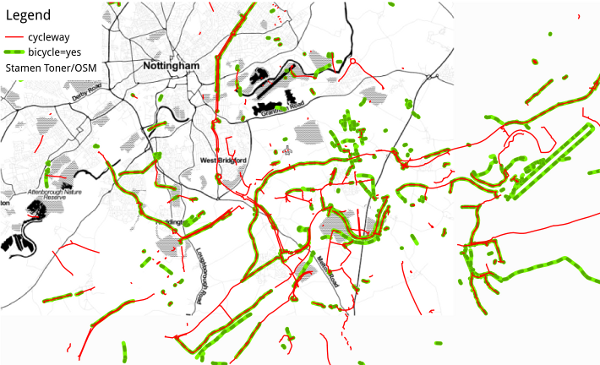
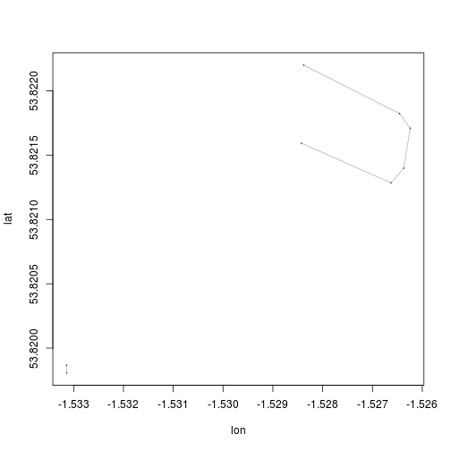

osm-cycle
=========

This repository is home to a project looking at cycle path data
on Open Street Map (OSM). The aims of the project are as follows:

1. Describe the cycle path data in OSM and test the hypothesis that 
it is a good source of data on cycle paths in Great Britain, suitable for academic research.

2. Compare the OSM cycle path data with alternative data sources.

3. Describe and explain the spatio-temporal distribution of additions to the 
the cycle path dataset and investigate how this corresponds with investment in 
cycle schemes overall.

As indicated by the above aims this is a data-driven project.
So let's load some data:

### Load Nottingham cycle data

Some example osm bicycle path data has been made available to get 
a handle on what it looks like. 
The bicycle paths were filtered from Postgres database using two 
methods: `bicycle='yes'`, and `highway = 'cycleway'`, to 
demonstrate that there are different ways to define a cycle path in OSM, 
as in the real world. This is how to load these layers into R:


```r
library(rgdal)
```

```
## Loading required package: sp
## rgdal: version: 0.8-10, (SVN revision 478)
## Geospatial Data Abstraction Library extensions to R successfully loaded
## Loaded GDAL runtime: GDAL 1.10.0, released 2013/04/24
## Path to GDAL shared files: /usr/share/gdal/1.10
## Loaded PROJ.4 runtime: Rel. 4.8.0, 6 March 2012, [PJ_VERSION: 480]
## Path to PROJ.4 shared files: (autodetected)
```

```r
pBikeYes <- readOGR("data/", "lines-cycle-yes")
```

```
## OGR data source with driver: ESRI Shapefile 
## Source: "data/", layer: "lines-cycle-yes"
## with 712 features and 66 fields
## Feature type: wkbLineString with 2 dimensions
```

```r
pCycleway <- readOGR("data/", "lines-cycleway")
```

```
## OGR data source with driver: ESRI Shapefile 
## Source: "data/", layer: "lines-cycleway"
## with 969 features and 66 fields
## Feature type: wkbLineString with 2 dimensions
```

```r
pBikeYes <- spTransform(pBikeYes, CRS("+init=epsg:27700"))
pCycleway <- spTransform(pCycleway, CRS("+init=epsg:27700"))
```


What are the attributes of these lines?
Let's take a look:


```r
plot(pBikeYes, col = "blue")
plot(pCycleway, col = "red", add = T)
```

 


### Calclulate length
Let's look at the respective lengths of each line:


```r
library(rgeos)
```

```
## rgeos version: 0.2-19, (SVN revision 394)
##  GEOS runtime version: 3.3.8-CAPI-1.7.8 
##  Polygon checking: TRUE
```

```r
gLength(pBikeYes)/1000  # length in km
```

```
## [1] 109.1
```

```r
gLength(pCycleway)/1000
```

```
## [1] 150.2
```


Clearly, paths marked with the cyclway attribute in the highway variable
are slightly longer. Yet these points do not completely overlap, 
as illustrated in the map:



### Preliminary time series analysis

`osm2pgsql`, used to create the datasets loaded above, does not import timestamp data by default. Therefore, we use a different dataset to illustrate
time series data, this time loaded via the `osmar`R package.
See my [osm-tutorial GitHub page](https://github.com/Robinlovelace/osm-tutorial) 
for more on this.


```r
library(osmar)
```

```
## Loading required package: XML
## Loading required package: RCurl
## Loading required package: bitops
## Loading required package: gtools
## Loading required package: geosphere
## 
## Attaching package: 'osmar'
## 
## The following object is masked from 'package:utils':
## 
##     find
```

```r
load("data/bike-paths-lds.RData")
plot(bikePaths)
```

 

```r
class(bikePaths$nodes$attrs$timestamp)
```

```
## [1] "POSIXlt" "POSIXt"
```

```r
tstamp <- as.POSIXct(bikePaths$nodes$attrs$timestamp, format = )
hist(bikePaths$nodes$attrs$timestamp, breaks = "year")
```

 


### Further work

The above steps are very basic introductions to the osm datasets and how we we
work with them. In this project we will make similar analyses, but 
on a much larger scale. We hope to generate policy relevant findings 
about a) the quality of cycle path data in OSM and b) the spatio-temporal
distribution of paths, using imperfect OSM data as a proxy.


