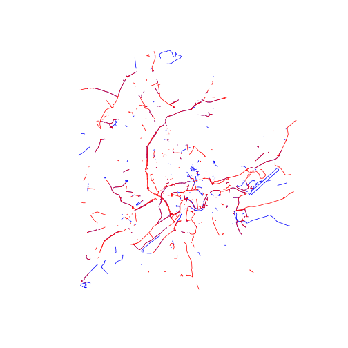

OSM-GB - basic analysis of the dataset
========================================================

The file "great-britain-latest.osm.pbf" was downloaded from [geofabrik](http://download.geofabrik.de/europe/great-britain.html) on 10th March 2014.

This file has a compressed size of 611 Mb, and is constantly growing due to new 
additions to the map from the OSM community. Clearly, this is a large file to manage, 
so the first stage was to filter out all of the information except for cycleways. 
This was done using the following command.

```{bash}
osmosis --read-pbf great-britain-latest-10-03-2014.osm.pbf --tf accept-ways highway=cycleway --used-node --write-xml gb-cways.osm
```

This command took 5 minutes to run on a 3rd generation Core i5 laptop computer with 12 Mb of RAM.
The resulting file was 260 Mb in size. It was decided that a further subset would be taken of this file, to facilitate fast preliminary analysis. To start with, we took the bounding box 
encapsulating Leeds and Nottingham, the home locations of the authors and where
the cycle network is best understood in intuitive terms.

```{bash}
osmosis --read-xml gb-cways.osm --bounding-box top=53.2 left=-1.8 bottom=52.7 right=-1.3 --write-xml NottLeedsCways.osm
```
This resulted in a file that was a more manageable size: 4 Mb

## Analysis in R

To read in the file, the following command was run, having first loaded the 
osmar package.


```r
# cway <- get_osm(complete_file(), source =
# osmsource_file('/media/SAMSUNG/geodata/osm-data/NottLeedsCways.osm'))
# cwaySp <- as_sp(cway, 'lines') save.image()
load(".RData")

nrow(cwaySp)
```

```
## Loading required package: sp
```

```
## [1] 1033
```

```r
plot(cwaySp)
```

 

```r
head(cwaySp@data)
```

```
##              id version           timestamp     uid           user
## 1861135 1861135      25 2013-01-12 18:18:51   31550 talkytoasteruk
## 4088003 4088003       1 2006-12-26 21:07:12     729        rjmunro
## 4329713 4329713       5 2013-01-12 18:18:55   31550 talkytoasteruk
## 4776311 4776311       9 2014-01-03 17:51:35 1390892           3tom
## 4776319 4776319       5 2012-09-09 16:39:05  178626       Rovastar
## 4776325 4776325       8 2012-09-09 16:39:06  178626       Rovastar
##         changeset type
## 1861135  14625555  way
## 4088003    172745  way
## 4329713  14625555  way
## 4776311  19791665  way
## 4776319  13046661  way
## 4776325  13046661  way
```

```r

# Let's see the distribution of times of contribution:
hist(cway$nodes$attrs$timestamp, breaks = "month")
```

 


You can also embed plots, for example:


```r
library(rgeos)
```

```
## rgeos version: 0.2-19, (SVN revision 394)
##  GEOS runtime version: 3.3.8-CAPI-1.7.8 
##  Polygon checking: TRUE
```

```r
plot(gLength(cwaySp, byid = T), cwaySp$timestamp, xlim = c(0, 0.1))
```

 


