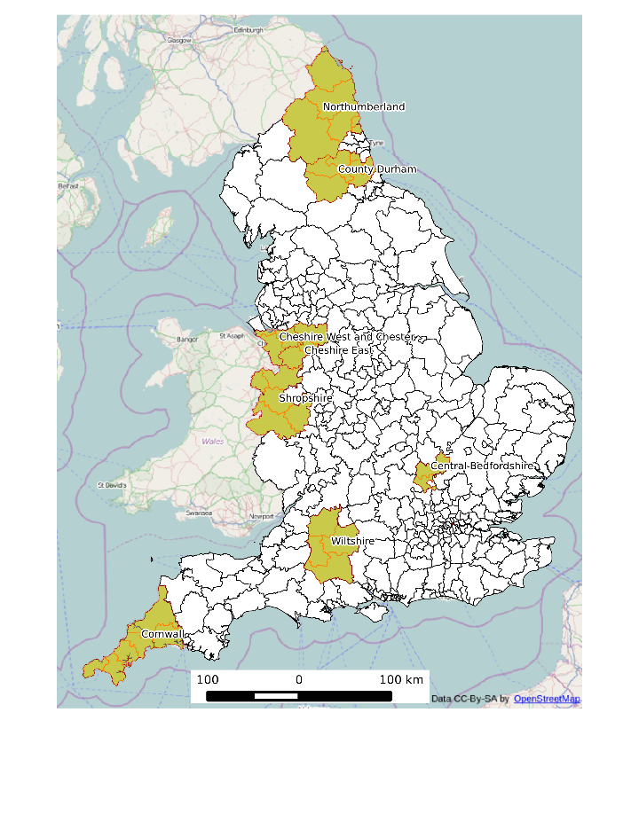

# Growth in cycling in the Leeds - national context and local variation

## Introduction

Between the 2001 and 2011 Census, there has been very little change in the overall
proportion of commuters using a bicycle to get to work, and this seems to be
indicative of wider trends in cycling as a form of transport overall
([Goodmand, 2013](http://www.plosone.org/article/info%3Adoi%2F10.1371%2Fjournal.pone.0071790)).
However, there has been much variability from place to place.
Some areas have seen very large rises in the proportion of peoplse cycling to work; some have seen
large declines and the majority have seen little change or slight drops (Fig. 1).

 


 


Overall Leeds is doing very well in this national context, especially
considering the comparatively poor performance of Northern Local authorities.
Between 2001 and 2011 the proportion of people saying they
cycle to work increased almost 0.5 percentage points, from 1.4% to 1.9%,
as can be seen from the queries below (to see how these numbers were 
generated, please see '[foundations.Rmd](https://github.com/Robinlovelace/osm-cycle/blob/master/cy-uptake/foundations.md)'
in the projects [online home](https://github.com/Robinlovelace/osm-cycle/tree/master/cy-uptake):
all work presented in this document is reproducible).


```r
load("updata/lam.RData")
lam[lam$NAME == "Leeds", c("NAME", "pCycle01", "pCycle")]
```

```
##      NAME pCycle01  pCycle
## 165 Leeds  0.01402 0.01865
```


To put that in the national context, Leeds ranks 34th out of all Local
Authorities in terms of cycling and 13th when the anomalous London zones are excluded.
In terms of Northern cities, Leeds has seen the fourth greatest shift to cycling,
trailing only Newcastle, Manchester and Sheffield.


```r
NL <- lam[lam$GOR != "London", ]
library(knitr)
kable(head(NL[order(NL$Abs.Growth, decreasing = T), c("NAME", "Abs.Growth")], 
    15))
```


|id   |NAME                          |  Abs.Growth|
|:----|:-----------------------------|-----------:|
|58   |Cambridge                     |   3.6052238|
|324  |Bristol, City of              |   3.1481369|
|36   |Oxford                        |   2.5072879|
|112  |Brighton and Hove             |   2.3784893|
|108  |Exeter                        |   1.8052927|
|97   |Newcastle upon Tyne           |   0.9818550|
|140  |South Cambridgeshire          |   0.9206315|
|4    |South Gloucestershire         |   0.8816691|
|82   |Manchester                    |   0.7558901|
|213  |Sheffield                     |   0.6950058|
|182  |Bournemouth                   |   0.6155516|
|130  |Bath and North East Somerset  |   0.5312177|
|165  |Leeds                         |   0.4634950|
|312  |North Tyneside                |   0.4063149|
|95   |Gateshead                     |   0.3945402|

## Variation within Leeds

The growth in cycling within Leeds has not been even either,
as illustrated by the map below. It is clear that growth has centered
in areas to the north of the city centre, towards Horsforth and roundhay.
These are relatively wealthy areas. More deprived areas have not benefited
to the same extent from Leed's uptake of cycling, such as the deprived areas of
Burmantofts to the east of the city centre.


```r
load("updata/leedsmsoaplot.RData")
library(ggmap)
library(rgdal)
ggmap(get_map(bbox(msoa.leeds))) + geom_polygon(data = msoa.leeds.f, aes(long, 
    lat, group = group, fill = Abs.Growth), alpha = 0.8) + scale_fill_gradient2(low = "red", 
    mid = "grey", high = "green", name = "Change in\ncycling (% points)")
```

 


The map below illustrates the current distribution of the proportion of people
cycling to work across different parts of Leeds. This is likely to be
roughly representative of wider cycling patterns (Goodman, 2013), and
therefore can be used to illustrate where the potential benefits from increased
uptake of cycling are greatest.


```r
ggmap(get_map(bbox(msoa.leeds))) + geom_polygon(data = msoa.leeds.f, aes(long, 
    lat, group = group, fill = pCycle * 100), alpha = 0.8) + scale_fill_gradient(low = "red", 
    high = "green", name = "Cycle commuters\n2011 (%)")
```

 

