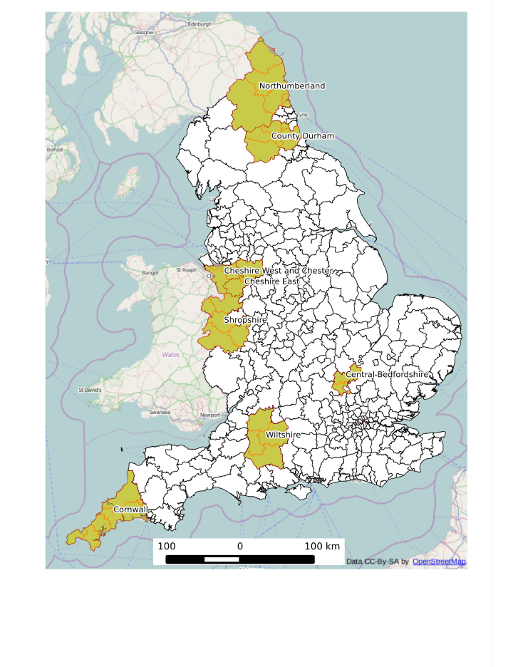

Investment in cycling infrastructure growth in bicycle commuting: what's the link? 
========================================================

# Introduction
Cycling has many benefits. These include,
<!--For the following bullets:\citep{Oja2011,Rojas-rueda2011,Saunders2013,}
\citep{borjesson2010value}
\citep{Jarrett2012,Rutter2013}
saelensminde2004cost semlyen2005cutting
-->

- improved health of cyclists
([Oja, 2011](http://www.fietsersbond.be/sites/default/files/Heath%20benefits%20of%20cycling%20REVIEW%20%28Oja%202011%29.pdf);
[Rojas-Rueda et al., 2011](http://www.creal.cat/media/upload/pdf/articledavidrojas_editora_2_217_1.pdf);
[Saunders et al., 2013](http://dx.plos.org/10.1371/journal.pone.0069912)).

- economic benefits at the individual level, for example due to lower trip times ([Borjesson and Jonas, 2011](http://www.researchgate.net/publication/228341559_The_value_of_time_and_external_benefits_in_bicycle_cost-benefit_analysEs/file/e0b495165b88274e0c.pdf)),
and reduced car use (Semlyen, 2005).

- economic benefits for society at large via reduced public health bills ([Rutter et al. 2013](http://www.sciencedirect.com/science/article/pii/S0749379712007301);
Jarrett et al. 2012) and wider impacts (Cavill et al., 2008; Krizek, 2007; Saelensminde, 2004).

- environmental benefits including lower greenhouse gas emissions and demand for roads
and motor vehicles ([Lenzen, 1999](http://www.sciencedirect.com/science/article/B6VH8-3WMK47K-4/2/707d71a2636a20c4e40d703ae128b1c7);
[Lindsay and Macmillan, 2011](http://onlinelibrary.wiley.com/doi/10.1111/j.1753-6405.2010.00621.x/abstract;jsessionid=111BFA6034AF092673E1C985C07238E8.f01t04?deniedAccessCustomisedMessage=&userIsAuthenticated=false);
[Lovelace et al., 2011](http://linkinghub.elsevier.com/retrieve/pii/S0301421511000620)).

- reduction in congestion during rush hour - this is a particular benefit of cycle commuting
(as opposed to leisure cycling) via improved traffic flow (Arnott et al., 2005; Downs, 2004).

- bicycles pose a lower risk to other road users than do cars, with benefits for
social equality (Jacobsen et al., 2009; Furness, 2010).

- 'wide boundary' impacts including heightened sociability of public space and
the hope that society may one day be able to operate without burning valuable finite resources
(Furness, 2010).

Due in part to these benefits, there has been
a noticeable increase in political commitment to cycling in many countries
in recent years.
<!--\citep{} -->
In the UK, for example, Prime Minister David 
Cameron announced that "we want to see cycling soar"
([Prime Minister's Office, 2013](https://www.gov.uk/government/news/government-shifts-cycling-up-a-gear))
as well as providing
a more specific statement of intent: "This government wants to make it easier and safer for people who already cycle
as well as encouraging far more people to take it up" (ibid).

Within this context of widespread political and evidence-based
support of policies to promote modal shift to cycling, a major barrier is specific
evidence on the effectiveness of different interventions. Clearly, the number of new cyclists
resulting from a specific policy intervention cannot precisely be known. However,
using an analogy from medicine, 'dose-response' type studies can greatly help
predict the impact of planned interventions.
<!--\citep{}-->
Transport planning is a long-term process with even longer-term impacts
and such evidence can aid the strategic decision making process (Schweizer and Rupi, 2014)
With limited public funds, it is critical to
maximise the cost-effectiveness ratio of cycle-related expenditure.

The purpose of this paper is to help fill this knowledge gap by analysising the change in
bicycle commuting across administrative zones across the UK. A geographically weighted regression
methodology will be used to estimate how effective different types of intervention - including
investment from the Cycling Demonstration Towns (CDT) initiative and number of cycle paths - have been.

# Literature on the spatial distribution of cycling

# Data

Census data on commuting provide the highest spatial resolution of
transport data in the UK, down to the level of Output Areas, consisting
of roughly 100 households each. The decadal Census of population also has the highest response
rate and number of participants of any national survey, due to the nationwide coverage
of the census and the legal requirement to complete it. Offering many opportunities
to transport researchers. The downsides to census data are that it only incorporates one
reason for trip (commuting) and its poor temporal resolution. However, recent work
shows that the modal split for commuting is highly correlated with
modal split for all trips (r > 0.9 for private modes and public transport, dropping to r = 0.77
for cycling), suggesting that commuting is a reasonable proxy for travel behaviour overall
\citep{Goodman2013}. In addition, the annual publication of results from the [National
Travel Survey](https://www.gov.uk/government/collections/national-travel-survey-statistics)
provide higher temporal resolution to complement the 10 year cycle of the census.

The input data for this study were tables of commuter mode share by administrative zone
between the 2001 and 2011 Census of population. In line with the principle of parsimony,
the modelling approach was to start simple (with large geographical zones)
and move to analyse higher resolution spatial datasets as the analysis progressed.

A GIS problem that had to be overcome early in the analysis was the conversion
of 2001 Local and Unitary Authorities (combined with the 'merge' function in QGIS)
into 2001 Local authority areas.
As shown in Fig. x, there are 8 new local authorities which encapsulate
many (37) smaller areas from the 2001 administrative zones.
The result of this process of spatial aggregation was all 324
'lower tier' Local Authorities in England
(excluding the Isles of Scilly and City of London, for which there were no data).
Mode of travel to work data was thus made directly comparable between 2001 and 2011
administrative zones.

 

# Method

