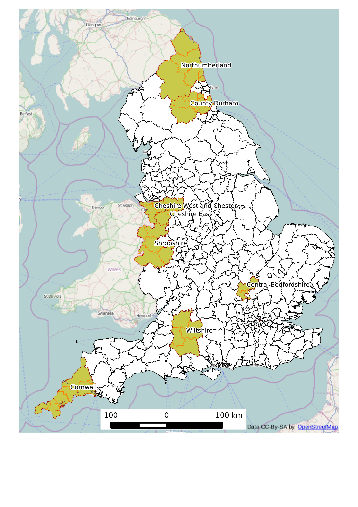

<!--Investment in cycling infrastructure growth in bicycle commuting: what's the link? -->
<!--How to increase cycling locally? Exploring the impact of investment, demographics and road safety in England between 2001 and 2011-->
<!--How to increase cycling locally? Exploring the changing distribution of cycle in England between 2001 and 2011-->

A geographical exploration of the factors associated with changes in bicycle commuting in England between 2001 and 2011
========================================================


# Introduction
During the early years of the 21st century
the nature of threats to the long-term well-being of the planet
and its inhabitants have become increasingly clear. We have
more data than ever about the problems,
from satellites monitoring the impacts of climate change
([McMillan et al., 2014](http://onlinelibrary.wiley.com/doi/10.1002/2014GL060111/abstract))
to detailed global statistics on likely decline rates of
unconventional oil and gas supplies
([Hughes, 2013](http://www.nature.com/nature/journal/v494/n7437/full/494307a.html)).
Yet collectively humanity seems unable to act on these cues,
raising the spectre of past civilisational collapse
and potentially bleak prospects for future generations
([Beddoe et al., 2009](http://www.pnas.org/content/106/8/2483.abstract);
[Ehrlich and Ehrlich, 2013](http://rspb.royalsocietypublishing.org/content/280/1754/20122845.full)).

The current energy predicament is often framed in purely environmental terms
yet climate change and resource depletion
are likely to have substantial negative impacts on human health
([McMichael et al., 2006](http://www.thelancet.com/journals/lancet/article/PIIS0140-6736%2806%2968079-3/abstract)).
On the other hand, some proposals to reduce reliance on fossil fuels have potential
health benefits ([Cifuentes et al., 2001](http://www.sciencemag.org/content/293/5533/1257.short)).
Nowhere is this more noticeable than
in the transport sector where the
replacement of motorised modes by walking and cycling
could provide physical activity to increasingly sedentary populations
([Michaelowa and Dransfeld, 2008](http://www.sciencedirect.com/science/article/B6VDY-4R00FMB-4/2/82bae464d0f4e053ced6751f608cbff9);
[Gross et al., 2009](http://www.ukerc.ac.uk/support/TransportReport);
[Jarrett et al., 2012](http://www.ncbi.nlm.nih.gov/pubmed/22682466);
[Woodcock et al., 2009](http://www.ncbi.nlm.nih.gov/pubmed/19942277))

Although the problems of sedentary lifestyles and fossil fuel dependence
are well understood, effective solutions are elusive.
In some instances unintended consequences
have led to 'solutions' that worsened the situation
while leaving the root causes un-addressed (e.g.
[Sheehan, 2009](http://dx.doi.org/10.1016/j.copbio.2009.05.010)).
Various theories have been developed to explain our collective failure to 
change direction 
([Berners-Lee and Clarke, 2013](http://www.burningquestion.info/)).
Generally these revolve around a failure to understand that
long-term problems at the interface between the human economy and the Earth's physical
systems are entrenched, complex and interdependent
([Smil, 2008](http://mitpress.mit.edu/books/energy-nature-and-society)).

It is within this wider context that questions of transport and health
should be considered
(Woodcock et al., 2009). The 'global energy challenge'
([Lewis and Nocera, 2006](http://www.pnas.org/cgi/content/long/103/43/15729))
and associated long-term health implications form the backdrop of this paper.
Rather than tackle the issues head-on, this paper focusses on one area of policy
where reductions in energy use have great potential to improve health outcomes and
improved quality of life more generally: personal travel. The research is targeted in terms
of its geographic scope (focussing solely on England),
time scales (analysing shifts over a decade) and type of travel 
(focussing on commuting), but
relevant to the global context. 

Framed in this way, cycling to work is relevant to
discussions of humanity's short term well-being and
longer term survival: the full benefits of a shift to cycling now may only
be realised in the future.
A striking feature of the bicycle is that it is a highly accessible technology
(almost everyone worldwide can realistically aspire to own one),
yet it tackles a very wide range of issues (Komanoff, 2004).
Interventions that can simultaneously provide
health, energy, economic and social benefit are the mythical 'golden bullets'
that policy makers dream of yet almost never encounter. Switching from
driving to cycling
is just such a 'win-win' solution (Robinson, 2005). It helps solve
an array of issues in one simple step.
Indeed, the sustainability challenge can be seen as an overinflated balloon:
squeeze one area of it and a bulge generally appears elsewhere (Berners-Lee and Clarke, 2013).


This paper starts from the
premise that cycling is a desirable outcome for health and other
reasons. There is much research supporting this premise and
the benefits of active travel more broadly.
Less research investigates which policies are most
likely to boost cycling in different places at the sub national level (Fraser and Lock, 2011).
International
comparative studies have helped explain why cycling flourishes in some countries whilst barely accounting
for 1% of trips in others (Pucher and Buehler, 2008).
A growing body of research seeking to explain variation in
bicycle use between smaller administrative zones (see the Literature Review section).

The decision to focus at the sub-national scale was not driven
solely by lack of evidence at the local level.
There are important social, cultural and spatial-economic differences
between nation states, meaning that what works in one country may not
always work in another.
In addition, we argue that explaining national-level variation
is a higher priority from the perspective of local transport planners -
those who implement the details of strategic plans and decide precisely how
investment in cycling is spent.

The conditions associated with
growth in cycling is a policy relevant area of knowledge
about which more evidence is needed (Fraser and Lock, 2011). A central motivation of
this paper is to provide information to help fill this 'knowledge gap'.
The aim is to inform the policy
making process by supplying evidence about which important factors are within
the scope of local transport planners to influence. (For example, if topography
and weather are found to completely explain growth in cycling, there is little
transport planners can do compared with if provision of cycle paths is found
to explain much of the change.) Within this question, the following hypotheses were
generated, based on the literature on the spatial distribution of cycling (see section x).
The expectations were, certeris parabis (all things being equal), that:

- Areas with high incomes would see disproportional increases in cycle commuting.
- Length of cycle paths (a proxy for investment in cycling) will be associate with higher than
expected growth rates in cycling.
- A good safety record on cycling (relative to the number of bicycle commuters)
will be associated with high growth rates.
- Areas that had received central government support for cycling, through the Cycling
Demonstration Towns initiative, would see growth in cycle commuting.

<!-- Breakdown this question??? -->

## The benefits of cycling

Unlike some other types of
environmental intervention, there are no major downsides to
bicycle uptake:
cyclists (often unwittingly) provide many benefits to the wider system
whilst simply enjoying a fast and healthy for of transport. To be specific,
there is strong evidence of social, environmental and
economic benefits of cycling  in the following areas:

- Improved health of cyclists
([Oja, 2011](http://www.fietsersbond.be/sites/default/files/Heath%20benefits%20of%20cycling%20REVIEW%20%28Oja%202011%29.pdf);
[Rojas-Rueda et al., 2011](http://www.creal.cat/media/upload/pdf/articledavidrojas_editora_2_217_1.pdf);
[Saunders et al., 2013](http://dx.plos.org/10.1371/journal.pone.0069912)).

- Economic benefits at the individual level, for example due to lower trip times ([Borjesson and Eliasson, 2011](http://www.researchgate.net/publication/228341559_The_value_of_time_and_external_benefits_in_bicycle_cost-benefit_analysEs/file/e0b495165b88274e0c.pdf)),
and reduced car use (Semlyen, 2005).

- Economic benefits for society at large via reduced public health bills ([Rutter et al.,2013](http://www.sciencedirect.com/science/article/pii/S0749379712007301);
Jarrett et al.,2012) and wider impacts (Cavill et al., 2008; Krizek, 2007; Saelensminde, 2004).

- Environmental benefits including lower greenhouse gas emissions and demand for roads
and motor vehicles ([Lenzen, 1999](http://www.sciencedirect.com/science/article/B6VH8-3WMK47K-4/2/707d71a2636a20c4e40d703ae128b1c7);
[Lindsay and Macmillan, 2011](http://onlinelibrary.wiley.com/doi/10.1111/j.1753-6405.2010.00621.x/abstract;jsessionid=111BFA6034AF092673E1C985C07238E8.f01t04?deniedAccessCustomisedMessage=&userIsAuthenticated=false);
[Lovelace et al., 2011](http://linkinghub.elsevier.com/retrieve/pii/S0301421511000620)).

- Reduction in congestion during rush hour - this is a particular benefit of cycle commuting
(as opposed to leisure cycling) via improved traffic flow (Arnott et al., 2005; Downs, 2004).

- Bicycles pose a lower risk to other road users than do cars, with benefits for
social equality (Jacobsen et al., 2009; Furness, 2010).

- 'Wide boundary' impacts including heightened sociability of public space and
the hope that society may one day be able to operate without burning valuable finite resources
(Furness, 2010; Komanoff, 2004; Sustrans, 2012).

## Pro-cycling policies: a UK perspective

Due in part to these benefits, there has been
a noticeable increase in political commitment to cycling in many countries,
as exemplified by rapid growth in public investment in bicycle share schemes
(Fishman et al., 2013).
In the UK, for example, Prime Minister David 
Cameron announced that "we want to see cycling soar"
([Prime Minister's Office, 2013](https://www.gov.uk/government/news/government-shifts-cycling-up-a-gear))
as well as providing
a more specific statement of intent: 
"This government wants to make it easier and safer for people who already cycle
as well as encouraging far more people to take it up" (ibid).

Within this context of widespread political and academic
support of policies to promote modal shift to cycling, a major barrier is specific
evidence on the effectiveness of different interventions. Clearly, the number of new cyclists
resulting from a new bicycle path or policy cannot precisely be known. However,
using an analogy from medicine, 'dose-response' type studies can greatly help
predict the impact of planned interventions (Pucher et al.,2010).
Transport planning is a long-term process with even longer-term impacts
and such evidence can aid the strategic decision making process (Schweizer and Rupi, 2014)
With limited public funds, it is critical to
maximise the cost-effectiveness ratio of cycle-related expenditure.
```{r, echo=F}
# such as those undertaken by x and y,
```

More numerous and rigorous studies
could therefore help increase the rate of cycling in
many areas, assuming that funding and political will are abundant.
The purpose of this paper is to help fill this knowledge gap by analysing the change in
bicycle commuting across administrative zones across the UK. A geographically weighted regression
methodology will be used to estimate how effective different types of intervention - including
investment from the Cycling Demonstration Towns (CDT) initiative (see Gross et al., 2009) and
an estimate of the quality of the cycle network - have been.

# Literature review: the spatial distribution of cycling

A systematic review of the impact of various policy relevant factors on cycling was
undertaken by Fraser and Lock (2011). This paper
condensed the literature on the subject down to 21 papers. Of these, 11 found
statistically significant relationships between environmental factors
and the *rate* of cycling (not growth in cycling, as reported in
this study). Cycle paths, land use, distance of trip and the presence of
green space were the only factors found to be significantly correlated with
cycle use in more than one study, leading to the conclusion that
more studies are needed to explore the
impacts of different policies and environmental conditions on cycling uptake
(Fraser and Lock, 2011). This paper fits into this call for evidence, with
an *ecological* (administrative zones are the unit of analysis) appraisal
of the impact of different variables in change in cycling to work, based on
Census data.

The Census travel to work statistics have been used in many studies
to investigate the spatial distribution of travel patterns overall
(e.g. Titherage and Hall, 2006).
However, the number of studies focussed on active travel, and cycling in particular,
is much lower. Goodman (2013) provides a detailed and up-to-date account of
the spatial distribution of walking and cycling at the national level across England and Wales
and describes how it has changed between 2001 and 2011. The overall
rate of walking and cycling to work was found to have changed little, but
important regional differences were identified: at the regional and local authority level
cycling growth was largely concentrated in high density urban centres, notably London and Bristol.
The paper also provided new insight into the shifting social distribution of travel to work mode:
affluence is associated with motorised modes, although this association is weakening.
Walking and cycling was found to have grown most in the least deprived areas, with car use
tending to fall in the wealthiest areas (Goodman 2013).
The underlying reasons for these shifts was not explored:
"Future analyses could also explore associations with
geographic factors such as hilliness, climate and land use patterns;
although outside the scope of this paper, these may play a key role
in explaining local and regional variation" (Goodman, 2013, p.9).
The present paper follows this suggestion by exploring the
factors associated with growth in bicycle commuting.

Multivariate regression models have been used to help explain
the spatially uneven distribution of the proportion of commutes
made by bicycle. Parkin et al. (2008) used a logistic regression model
to identify the most important factors related to cycling at the ward
level in England and Wales. 81% of the variability in the proportion
of commuters cycling to work could be explained by the model. The proportion
of white male commuters (positive), number of cars per household (negative)
and income deprivation (negative) were found to be powerful socio-economic
explanatory variables. Interestingly, hilliness was found to have a negative
impact on cycle commuting in the model. Road traffic (via the proxy 'transport
demand intensity') was negatively related to cycling to work whereas the proportion
of off-road routes had a positive impact. These latter findings
indicating transport infrastructure is an important policy
area for encouraging cycling.

Another useful output from this paper was the estimation of a 'saturation point',
referred to as 'carrying capacity' in population ecology (Lovelace et al., 2011),
a theoretical upper limit on the proportion of people cycling to work in any particular
area. This was calculated to be 43% of trips, higher than any wards in the UK, but comparable
with the proportion cycling to work in some Dutch areas (Parkin et al.,2011)

# Data

British Census data on commuting provided the dependent variable for this paper.
The Census was chosen because it has the greatest spatial resolution of
transport data in the UK and the highest response
rate and number of participants of any national survey, due to
the legal requirement to complete it. Downsides for transport
researchers include its inclusion of only one
reason for trip (commuting) and poor temporal resolution,
although these problems can to some extent be overcome by integrating
census data alongside more detail surveys. Recent work
suggests that the modal split for commuting is highly correlated with
modal split for all trips (r > 0.9 for private modes and public transport, dropping to r = 0.77
for cycling), indicating that commuting may be a reasonable proxy for travel behaviour overall
(Goodman2013). In addition, the annual publication of results from the 
[National Travel Survey](https://www.gov.uk/government/collections/national-travel-survey-statistics)
provide higher temporal resolution to complement the 10 year cycle of the census.

The input data for the independent variable
were tables of commuter mode share by administrative zone
between the 2001 and 2011 Census. England was used instead of the wider area
of Great Britain because the compatibility issues associated with comparing spatial
units is made more complex with the addition of Wales and Scotland. In the case of Scotland,
travel to work data are not available on the data dissemination portal Casweb.
An additional reason for excluding Scotland and Wales from the analysis is that they
have different travel to work characteristics than England, with much lower population
densities and generally levels of isolaiton and car reliance (Gray et al., 2001; Nutley, 1980).

A data problem that had to be overcome early in the analysis was the conversion
of 2001 354 Local and Unitary Authorities (combined with the 'merge' function in QGIS)
into 2011 local authority areas (LAs),
composed of English Districts, Unitary Authorities and London Boroughs.
As shown in Fig. x, there are 8 2011 LAs which encapsulate
many (38) 2001 administrative zones.
The result of this process of spatial aggregation was all 324
'lower tier' 2011 LAs, for which the
travel to work data was directly comparable between 2001 and 2011.

```{r fig.cap="Map illustrating the mismatches between 2011 Local Authorities and 2001 Unitary Authorities and Districts", fig.width=10, fig.height=13, echo=FALSE}
library(png)
library(grid)
img <- readPNG("../figures/las01-not11.png")
 grid.raster(img)
# 
```

The other scales of analysis used in this study were Medium Super Output
Areas and Lower Super Output Areas (MSOAs and LSOAs with average
working populations of x and y people, respectively).
Output Areas are the smallest administrative units in the UK,
which contain on average around 100 households. These were
not used as the units for analysis
because their small size makes it impractical to extract
geographic information all of them across England. In addition
small values in OA data are "randomly adjusted "
in the Census tables for low counts (see, for
example, http://www.nomisweb.co.uk/livelinks/4652.xls ).

The data pre-processing for these areas was simpler as there has been less
change between 2001 and 2011 for Output Areas than other types of administrative
geography. Of the 6,781 2001 MSOAs, 98% (6,640) are unchanged in the 2011 dataset. 
The remaining 141 zones are contiguous with the more numerous (n = 6791) 2011
zones (fig. 1).
Because many of 2001 MSOAs were split-up into small 2011 zones, the solution was
not as simple as allocating the misfits to the nearest 2011 zones. Instead,
we took advantage of the unchanging geometry of the OA zones and calculated
incomplete records by aggregating 2001 data from OA-zones in each incomplete
2011 zone.

```{r, echo=FALSE}
# The same process was applied to LSOA
# level data, resulting in xx LSOA zones containing data from both the 2001 and 2011 Census.
# only do LSOA-level analysis after you've got good results from the simpler shapes
```

The explanatory variables used in the baseline model
to test the hypotheses listed in section 1 were:

- *Avinc*, the mean average income for households in each area, downloaded at the MSOA level
from the official data repository [data.gov.uk](http://data.gov.uk/dataset/household_earnings_estimates_-_model-based_estimates_of_income_for_msoas).

```{r, echo=FALSE}
# Avchange 
```

- *Lpath*, the of high quality cycle paths within each area. This dataset was provided
in a series of MySQL databases by CycleStreets.net and processes in R.

- *Bcrash*, a proxy on the safety record on cycling in each area defined as a severity-weighted
count of the number of cycle-related road traffic incidents reported in the STATS19 database
from the beginning of 2005 until the end of 2012.

- *CDT*, a crude proxy of investment in cycling in each zone, defined as a binary variable:
0 for areas outside the scope of the CDT project and 1 for areas that did receive funding.

The range and distribution of these variables is displayed graphically and numerically
in fig. 2. This *plot matrix* shows the relationship between each of the input
variables in the model. Of note is the strong positive correlation between $Bcrash$
and $\Delta pCycle$ (*Q pCycle* is not shown for space reasons, but $Bcrash$ had a
similarly strong negative correlation with this variable, of 0.31).

```{r fig.cap="Scatter plot matrix showing distributions and relationships between the variables of the baseline model", fig.width=9, fig.height=7, echo=FALSE}
img <- readPNG("figure/ggpairs.png")
 grid.raster(img)
# 
```

## Additional variables

In addition to these baseline input datasets, a number of other variables
were tested to investigate the relationship between other variables and cycling to work.
These were, in order that they were tested:

- The proportion of trips made by car in 2001 ($pCar$)
- The change in the proportion of young (18 - 39), white males in each area, 2001 to 2011 ($\Delta pYWM$),
following Parkin et al. (2008) who found this to be an important explanatory variable.
- The number of cars per household in 2001 ($carOwn$) and change in car ownership ($\Delta carOwn$)


# Method

In line with the principle of parsimony,
the modelling approach was to start simple by reporting key statistics
about changes in cycle commuting in England before progressing to 
a regression model. 
<!-- before few variables) and move to analyse higher resolution spatial datasets as the analysis progressed.-->

The proportion of people cycling to work
(*pCycle*) was calculated as the total number
of bicycle commuters ($Cycle$) divided the number
of people commuting by all modes ($Commute$) for each area ($a$).
At the national level, this can be represented as
the population-weighted sum of *pCycle* for all areas:

$$PCycle = \sum_{a=1}^n \frac{Commute_a}{\sum_{a=1}^n Commute_a} \frac{Cycle_a}{Commute_a} $$

where $PCycle$ is the proportion cycling overall.
This is expressed more concisely as the total number of cyclists divided by
the total number of commuters ($PCycle = Cycle / Commute$). However, the above equation
is useful in demonstrating how a single national value can mask substantial regional
variation and highlights the importance of a zone's total population:
while the *average* value of *pCycle* dropped from 3.3 to 3.1%
across English LAs from 2001 to 2011, *PCycle* remained constant.
In other words cycling grew in the (urban) LAs with higher than average populations.

The categories of "unemployed"
and "work from home" were deliberately excluded from the $Commut$ count,
to prevent changes in employment
structure influencing the result: if a commuter belt shifted
away from car driving towards 'teleworking'
(working from home), for example, this method could provide an unfairly optimistic
impression of the uptake of cycling.

The dependent variable, *change* in the proportion of people cycling to work,
can be defined in two ways. First, the *absolute difference* in the percentage
of people cycling to work ($\Delta pCycle$) was calculated by subtracting the 2011 results from
the 2001 results. Second, *relative change* ($Q pCycle$) was defined as proportion of people
cycling in 2011 divided by the rate in 2001.

A linear regression model was used to test the impact of the explanatory variables
on model fit, and to elucidate the direction of influence. Following the principle
of parsimony in model design, a simple model based on the hypotheses presented in
the introduction was developed first. Against this baseline the performance of
different model runs was compared. To this end the following alterations were made:

- Changes to the number and type of explanatory variables used.
- Subsetting the observations used for the model (e.g. to exclude London)
- Altering the dependent variable itself to explore the relationship between
absolute and relative increases in cycling.


# Results

The rate of cycling between 2001 and 2011 census was found to have changed
very little, being 3.1% in both cases. However, there was substantial variation
between the zones in terms of change in cycling.
There is a strong positive skew in the distribution the growth rate
(fig. 3): less than a quarter (74) of LAs saw the modal share of cycling rise, by an average of 30%
whereas the majority of LAs (250) saw small declines in the proportion of
people cycling. 

In terms of absolute growth, the distribution is more
symmetrical, with the vast majority of zones (264 zones, 81%) seeing less than a 1% change
either way in absolute proportion of people cycling to work.
These results are plotted geographically in fig. 4.

```{r fig.cap="Histograms of the distribution in the growth in cycling in absolute (above) and relative (below) terms", fig.width=8, fig.height=8, echo=FALSE}
img <- readPNG("figure/cygrowth-hist.png")
 grid.raster(img)
# 
```

```{r fig.cap="Change in proportion of cycle commuters in England, 2001 to 2011", fig.width=7, fig.height=8, echo=FALSE}
img <- readPNG("figure//overview-la.png")
 grid.raster(img)
```

It is interesting to note that the average cycling rate in 2001
was lower for zones where cycling dropped (3.3 %) compared with zones where cycling grew (3.7%).
Indeed, the variability in the proportional of people cycling grew
between 2001 and 2011, despite the mean remaining the same: 
the standard deviation increased from 2.5 percentage points in 2001 to
2.7 in 2011.
At the MSOA level the standard deviation of the percentage
of people cycling to work also grew noticeably, from
2.7 to 2.9.

Far from cycling becoming more accessible to everyone everywhere, these
results provide some geographical evidence
for a divergence between the cycling 'haves' and 'have nots'. Spatial inequality in
cycling as a mode of travel to work in recent years in England, supporting the
hypothesis of positive feedback loops in modal shift to cycling through
'strength in numbers' and the normalisation of cycling culture
(borjesson2012benefits, goetzke2011bicycle).

The regional distribution of growth in cycling, with its focus on
London, is also evident from fig 5, which shows the expected
high correlation between the percent cycling to work in 2001 and 2011
(r-squared = 0.82).
The $x = y$ line in fig x represents the 'break even' point
above which cycling has grown and below which it has dropped. Thus,
there are 74 points above the line and the rest fall below.
The further points are located from this break even line the more cycling has
changed in that area. The colours illustrate that many of the zones with the greatest growth
in cycling are located within the Greater London Authority.

```{r fig.cap="Scatterplot of the proportion of commuters who report using a bicycle as their main means of travel to work in 2001 (x axis) and 2011 (y axis). Colours correspond to English regions.", fig.width=7, fig.height=8, echo=FALSE}
img <- readPNG("figure/scatter-color.png")
 grid.raster(img)
```

The regional pattern represented by the colours in fig. 5
is emphasised in Table 1, which shows that
outside London there were falls in the proportion
of people cycling to work, with the greatest declines
in the Midlands and the North: the average LA in the Midlands
saw the proportion of people cycling to work drop by a fifth.

Table 1: regional differences in the change in cycling as a commuter mode in England, 2001 to 2011.

|Region    |Relative change|Absolute change|
|:---------|-----------:|-----------:|
|London    |   47.4|   1.6|
|Midlands  |  -19.7|  -0.7|
|North     |  -12.3|  -0.5|
|South     |   -7.8|  -0.2|

Because of this apparent "London exceptionalism",
the analysis was re-run with London removed.
It was found that outside London, the proportion of
all people cycling to work dropped substantially, from
3.2% in 2001 to 2.9% in 2011. *The average LA outside London
saw a 12% drop in the proportion of people cycling*. These results
suggest that attempts to 'get Britain cycling' have so far failed
outside of the capital, which has seen the country's only
large 'congestion charge' scheme encourage active travel
(nakamura2014economic).

Some urban areas outside London broke the trend, seeing cycling
as a mode of travel to work grow, yet only
in 12 zones did the cycling to work increase by more than half a percentage point.
(These were, in descending order of growth rate, were Cambridge, 
Bristol, Oxford, Brighton, Exeter, Newcastle, South Cambridgeshire, South Gloucestershire,
Manchester, Sheffield and Bournemouth.) Of these, only 5 had growth rates above
1 percent. In the name of balance, it was decided to focus equally on the areas
where cycling has fallen greatly: there is a tendency towards picking 'best case'
studies in the cycling literature. This can be seen as analogous to
the disproportionate non-publication of medical trials that have negative results:
it is important to focus on 'failures' as well as 'success stories' to provide
impartial evidence to policy makers ([Jones et al., 2013](http://www.bmj.com/content/347/bmj.f6104?tab=citation)).

Table 2 presents the growth in cycling in the top 5 and bottom
5 areas in terms of absolute shift in the proportion of people cycling
to work. It is noticeable that while 4 of the top 5 received central government funding
between 2001 and 2011 from the CDT initiative, none of the bottom 5 did.
(Oxford is conspicuously missing from the list of CDT beneficiaries,
and some cycle campaigners have accused the local council of
failing to properly maintain the city's existing cycle infrastructure
([Horne, 2008](http://www.oxfordmail.co.uk/news/2296153.print/)).)
This suggests that, in addition to investment helping to increase the rate of cycling,
it can also serve to maintain it and prevent declines in areas that have an
already high rate of cycling.

Table 2: Statistics on cycle commuting from the top 5 and bottom 5 local authorities in
England in terms of the absolute change in the proportion of commuters cycling to work.
Note

|Local Authority             |  pCycle 2001|  pCycle 2011|  Abs. growth ($\Delta pCycle$)|  Rel. growth ($Q pCycle$)| CDT  |
|:----------------------------|---------:|-------:|-----------:|-------:|:---------|
|Cambridge                    |      28.3|    31.9|         3.6|    12.7|2009      |
|Bristol, City of             |       4.9|     8.1|         3.1|    63.7|2009       |
|Oxford                       |      16.2|    18.7|         2.5|    15.5|No       |
|Brighton and Hove            |       3.0|     5.3|         2.4|    80.1|2005       |
|Exeter                       |       4.8|     6.6|         1.8|    37.3|2005       |
|                       |       |     |         |    |       |
|:----------------------------|---------:|-------:|-----------:|-------:|:---------|
|Boston                       |      11.1|     6.9|        -4.3|   -38.4|No       |
|Hull                         |      12.3|     8.3|        -4.0|   -32.2|No       |
|Waveney                      |       9.3|     6.5|        -2.7|   -29.6|No       |
|Fenland                      |       7.4|     4.9|        -2.6|   -34.4|No       |
|North East Lincolnshire      |       8.2|     5.6|        -2.6|   -31.2|No       |

## Regression model results

The baseline model was able to explain 16% of the variation in $\Delta pCycle$
and 14% of the variability in $Q pCycle$ across all zones, with adjusted R-squared
($aR^2$) values of 0.16 and 0.14 respectively.
This is a statistically
significant by not particularly impressive result. In addition, the most
significant variable, $Bcrash$, had the opposite sign as
expected, indicating that cycling may have become proportionally riskier
in places where cycling has grown the most (see Table 3). Indeed,
the correlation between $Bcrash$ and $\Delta pCycle$ was strongly
positive (r = 0.31).

We can speculate why this may be - perhaps car drivers in growth
areas were relatively unused to high cyclist volumes or perhaps
accident rates are higher amongst new cyclists. Yet correlation
does not prove causality and the number of cycle commuters is a poor
indication of *exposure*, meaning that the results do not
show with any certainty that cycling really did tend to become less safe
in areas where cycling grew. It is implausible to assume that growth in cycling
was *caused* by the increase in *Bcrash* (although the reverse may be true),
so this variable was removed from subsequent model runs.

$Avinc$ and $CDT$ had a statistically significant (p < 5%)
impact on $\Delta pCycle$ in the baseline model in the direction expected.
$Avinc$ had a strong positive correlation with $\Delta pCycle$ 
(r = 0.22) and $Q pCycle$ (r = 0.21). Despite there being only
17 CTD projects (their impact spread across 19 LAs), the impact
on the model was statistically significant: CDT funding increased
the proportion of people cycling in an LA by on average 0.6 % points
in the baseline model.
To explain a greater proportion of the variability in change in cycling to work,
the additional variables were added in place of *Bcrash*.

Table 3: Results from the baseline model.

|Variable     |     Estimate|  Std. Error|    t value|   P|
|:------------|------------:|-----------:|----------:|----------:|
|(Intercept)  |   -2.32|   0.33|  -7.1|  0.00|
|Avinc        |    0.00|   0.00|   4.3|  0.00|
|Lpath        |  -28.08|  26.88|  -1.0|  0.29|
|Bcrash       |    3.91|   0.71|   5.5|  0.00|
|CDT        |    0.61|   0.25|   2.4|  0.02|


## Additional variables

Adding more variables improved the model fit. With $Bcrash$ removed,
the additional variables mentioned in the Data section were tested one by one.
The variable that had by far the greatest impact on the model was
the proportion of trips made by car drivers in 2001. Replacing $Bcrash$ with
*pCar* in the baseline model meant that half of the variation in $\Delta pCycle$
could be explained, rising to 2/3 when $Q pCycle$ was predicted
($aR^2$ 0.50 and 0.66, respectively).

Replacing  $pCar$ with $\Delta pYWM$ led to a poorer model fit, although
the variable had a statistically significant impact on the model at the 5% level
in the expected positive direction as a predictor of $Q pCycle$. $\Delta carOwn$
also had a minimal effect on the model at this stage.


## Removing London

As can be seen in fig. 5, LAs within London had anomalously high growth
rates, some of which can be explained by factors exclusive to the capital
such as the congestion charge, slow traffic speeds and an influx of young,
mobile workers. A strong case can thus be made for treating London separately.
When London was removed, this had a large impact on the baseline model:
the *p* value of *CDT* fell dramatically, from 0.02 in the baseline model to
less than 1 in 100,000 with London excluded. In addition the slope of the
estimated impact of CDT funding increased to
0.8% points.

With London removed, the influence of $\Delta pCar$ dropped substantially although
it was still highly statistically significant in the expected direction. The impacts of
the other additional variables were statistically insignificant.

## The final model

Following the principle of parsimony, the simplest solution that explained a
high proportion of variability in cycling to work was chosen.
This was found to be the following equation:

$$Q pCycle \sim Avinc + pCar +  CDT $$

Across all Local Authorities, this model accounts for 2/3 of the change in
cycling. However, the final model results presented
in Table 4 exclude London LAs which were deemed to be anomalous.
This final model explains roughly 1/3 of the change in the rate of cycling
($aR^2$ = 0.27) based on only 3 variables, all of which are significant
at the 5% level. As before, $pCar$ was the most powerful explanatory factor.

Table 4: Results from the final model

|Variable     |  Estimate|  Std. Error|  t value|  P  |
|:------------|---------:|-----------:|--------:|---------:|
|(Intercept)  |    55.825|       8.783|    6.356|     0.000|
|Avinc        |     0.032|       0.008|    4.178|     0.000|
|pCar          |  -134.211|      14.078|   -9.534|     0.000|
|CDT          |     6.803|       3.424|    1.987|     0.048|


# Discussion

The analysis presented in this paper sheds some new light onto the spatial
distribution of change in cycle commuting across England. Furthermore,
the results provide an empirical basis
for discussion of how best to make cycling grow in the future.
The results show that changes in cycle commuting have not happened randomly across
space over the course of the last 10 years or so: clear patterns can be seen
from the maps and graphs of cycling change and these have implications for policy
makers tasked with making cycling soar.

The first point of discussion should be that cycling for personal transport,
like many other geographic variables related to health and the economy (Dorling, 2011),
has become more unequal over space in the last 10 years:
most of the growth in cycle commuting has happened in London. Excluding London
from the analysis, cycle commuting has declined overall from 3.2 to 2.9% of trips.
Within this aggregate figure, a few areas have seen
very impressive rates of growth in cycling and a number of these received central
government funding through the Cyclind Development Towns project. Yet the trend for
a typical English LA outside London has been decline: the median value of
pCycle dropped by 0.4% points from 2.9 to 2.5%, a worrying trend about which
academics and cycle campaigners are either unaware or tend to gloss over.

That is not to downplay the success stories, but it does raise the question:
why did cycle commuting in some areas grow against a backdrop of decline?
The paper has been able to provide some answers here: areas with high incomes,
historically low rates of car use and government support have tended to do well.
Of course, this does not prove cause and effect: it is plausible to suggest that
areas received cycle funding precisely because they were seen as success stories.

Let us return to the four hypotheses posed in the introduction. We have provided
statistically significant evidence that the health and other benefits of cycling are
disproportionately being enjoyed in high income areas, where much of the growth
has occurred. We have found no significant evidence of safe roads or bicycle path
provision leading to increased uptake of cycling, although more research is
needed in both areas and the study has by no means disproved a link. The
findings support previous calls for more rigorous studies exploring the impact
of different environments and policies on active travel (Fraser and Lock, 2011).
Specifically, there is a need for a database on public expenditure on cycling and
an up-to-date database on cycle paths and other pro-cycling features. Only with
official high quality databases (or improvements in Open Street Map) will we
able to compare the impacts of different interventions.

There are a number of limitations to the study.
Using areal units to explain any issue that is ultimately played out at the
individual level risks committing the 'ecological fallacy': falsely inferring
things about individuals based on aggregated data (Openshaw, 1983).
To avoid this problem we have been careful to state that the findings apply
only to areas and not necessarily to the citizens who occupy them.
We cannot know from the results, for example, that individuals on high incomes
are tending to cycle more, just that the number of people reporting cycling to
work in areas with high average incomes has grown. There is, however,
verbal evidence of the importance of class and cultural identity in
the context of cycling growth in wealthy areas (Aldred and Jungnickel, 2014),
with which our results coincide.

The research presented in this paper also raises important
questions about data quality. From a health perspective,
the number of people who use bicycles as their *main* form
of transport to work is far less important than the
number of people who cycle once or twice per week.
The marginal benefit of exercise decreases after a few
hours of moderate exertion per week and a roughly typical
cycle commute of 3 miles each way could easily reach this amount.
More important from a health perspective (and potentially from
an environmental perspective) is the number of people who *sometimes*
cycle to work, once or twice per week, but not always. Because cycling
is often a 'plan B' mode to be used occasionally, the potential impact of under-reporting
of trips is large. Conversely, there may be many people who entered cycling
as their primary mode of transport to work as 'aspirational cyclists'
who cycle occasionally but would like to think that they always do.
These questions of data quality require further analysis and the National
Travel Survey could provide a useful empirical starting point for future
research into this area. 

In terms of monitoring the geographical distribution of a shift to cycling,
a more suitable independent variable would be the total number of trips
taken by residents of each area per year. Even more specifically, estimates
of the total distance cycled in each area, and the social distribution of
this cycling activity across society as a whole would be preferable. Indeed,
if cycling is concentrated amongst healthy men, it is realising only a fraction
of the potential health benefits. 

```{r, echo=FALSE}
# really need average age change as a variable
```

 

# Conclusion

This study provides new evidence about the relationships between
a range of geographic factors and change in the proportion of people
cycling to work across England. Regression analysis at the level
of Local Authorities
<!--and smaller administrative zones across England-->
was used
to test the hypothesis that wealth, road safety, cycle infrastructure
and public investment are associated with growth in cycling. Of these
hypotheses statistically significant results were obtained supporting the
positive impact of the first two factors. The paper provides
statistical evidence to support the idea that high income groups are cycling
more which supports the wider 'peak car' narrative (Goodwin and Van Dender, 2013).

Perhaps more relevant for local policy makers is the finding that cycling grew
significantly *more* in areas that
received central government funding in the form of CDT status. Correlation does
not prove causality, but the results certainly support additional tranches of
central government funding for cycling.

The study uses *change* in the rate of cycling to work over 10 years as the
dependent variable, thereby providing policy relevant insight into the
factors that may be able to increase the rate of cycling in future years.
This differs from the majority of geographical studies on the subject, which have sought
to explain the rate of cycling at one specific point in time (e.g. Parkin et al., 2008).
These studies have tended to focus on
variables that are either inherent to the natural environment (e.g. topology, weather)
or which are not easy to alter through policy interventions (e.g. average distance
of trips) (Fraser and Lock, 2011). This paper, by contrast, deliberately focussed on factors over
which policy makers have some control or ability to target: bicycle paths, investment in cycling,
the spatial distribution of average incomes.

Amongst these factors, average income was found to be most strongly associated with
cycling, providing further evidence that growth in cycling has been driven in recent years
primarily by the wealthy (Goodman, 2013). This coincides with
evidence from the 'peak car' literature that high income groups are tending to
drive less each year (Metz 2013).
Of course, the average income of people in different areas is a factor outside
the control of most policy makers (although they may wish otherwise). Yet the
finding is important in terms of policy design as it provides additional evidence
that more needs to be done to promote cycling amongst the most
disadvantaged in society (Christie, 2011). The
study provides strong support to a conclusion derived from qualitative analysis that
"care needs to be taken to also develop interventions in
lower-income areas" (Aldred and Jungnickel, 2014).

An unexpected finding that merits further analysis was the strong negative relationship
between people driving to work in 2001 and growth in cycling. 
We can speculate that the result may be linked to confounding factors
such as average distances between home and work locations.
The strength of the correlation provides some evidence that cars and bicycles
can be seen in ecological terms as 'species' in direct competition (Lovelace et al.,2011).
The policy implication of this finding is that in some cases the best
way to promote active travel from a health perspective
may be to implement policies discouraging car use (Jacobsen et al., 2009).

There are limitations to study inherent to the methodology and use
of administrative zones as the unit of analysis. The focus on reported cycling
to work as the dependent variable is problematic because cycling to work is not
an either/or decision but something that can vary widely, from every day to a
few times per month (Stinson and Bhat, 2004). Such subtleties are simply
not collected in the Census: there is a trade-off between geographic resolution
and coverage from census data and depth and insight from individual-level surveys.
The paper therefore advocates further studies that seek to integrate detailed
survey datasets with information from the Census, for example by comparing
correlations between Census and individual level variables (Goodman, 2013)
or more complex techniques such as spatial microsimulation (Lovelace et al.,2014).

It is clear that more research is needed in the rapidly evolving global debate
about how best to promote cycling. Returning to the mounting evidence to society
mentioned in the introduction, we can also say that we have a mounting body
of evidence on how best to deal with these threats. Policies to promote
cycling represent one small option amongst many, but their
relative simplicity and low cost make them ideally suited to an economic context
of risk aversion and austerity. Pro bicycle interventions are also
exceptional in the wide
range of interrelated problems they tackle, often as an
unintentional 'co-benefit' to an efficient and enjoyable urban transport system.
There is a limited time horizon in which to invest still abundant physical and
human energy into a sustainable future, so the pro-cycling policies should continue
to be pursued with urgency. It is hoped that the evidence provided in this paper
will help ensure that such policies are implemented with swiftness, but not haste.

# References

Aldred, R., & Jungnickel, K. (2014). Why culture matters for transport policy: the case of cycling in the UK. Journal of Transport Geography, (early), 1–22. Retrieved from http://www.sciencedirect.com/science/article/pii/S0966692313002202
Arnott, R., Rave, T., & Schöb, R. (2005). Alleviating urban traffic congestion. MIT Press Books, 1.

Beddoe, R., Costanza, R., Farley, J., Garza, E., Kent, J., Kubiszewski, I., … Woodward, J. (2009). Overcoming systemic roadblocks to sustainability: The evolutionary redesign of worldviews, institutions, and technologies. Proceedings of
the National Academy of Sciences, 106(8), 2483–2489. doi:10.1073/pnas.0812570106

Berners-Lee, M., & Clark, D. (2013). The Burning Question: We can’t burn half the world's oil, coal and gas. So how do we quit? (p. 256). Profile Books. Retrieved from http://www.amazon.co.uk/The-Burning-Question-cant-worlds/dp/1781250456

Börjesson, M., & Eliasson, J. (2010). The value of time and external benefits in bicycle cost-benefit analysEs. In Proceedings of the 12th World Conference on Transport Research (WCTR) (pp. 11–15).

Cifuentes, L., Borja-Aburto, V. H., Gouveia, N., Thurston, G., & Davis, D. L. (2001). Hidden Health Benefits of Greenhouse Gas Mitigation. Science, 293(5533), 1257–1259. doi:10.1126/science.1063357

Ehrlich, P. R., & Ehrlich, A. H. (2013). Can a collapse of global civilization be avoided? Proceedings of the Royal Society B: Biological Sciences, 280(1754).

Fishman, E., Washington, S., & Haworth, N. (2013). Bike Share: A Synthesis of the Literature. Transport Reviews, 33(2), 148–165. doi:10.1080/01441647.2013.775612

Fraser, S. D. S., & Lock, K. (2011). Cycling for transport and public health: a systematic review of the effect of the environment on cycling. European Journal of Public Health, 21(6), 738–43. doi:10.1093/eurpub/ckq145

Furness, Z. (2010). One less car: Bicycling and the politics of automobility. Temple University Press.

Goodman, A. (2013). Walking, Cycling and Driving to Work in the English and Welsh 2011 Census: Trends, Socio-Economic
Patterning and Relevance to Travel Behaviour in General. PLoS ONE, 8(8), e71790. doi:10.1371/journal.pone.0071790

Gray, D., Farrington, J., Shaw, J., Martin, S., & Roberts, D. (2001). Car dependence in rural Scotland: transport policy, devolution and the impact of the fuel duty escalator. Journal of Rural Studies, 17(1), 113–125. doi:10.1016/S0743-0167(00)00035-8

Gross, R., Heptonstall, P., Anable, J., & Greenacre, P. (2009). What policies are effective at reducing carbon emissionsfrom surface passenger transport ? Retrieved from http://www.ukerc.ac.uk/support/TransportReport

Hansen, M. H., & Yu, B. (2001). Model Selection and the Principle of Minimum Description Length. Journal of the American Statistical Association, 96(454), 746–774. doi:10.1198/016214501753168398

Horne, D. (2008). £4m snub to city cyclists (From Oxford Mail). Oxford Mail. Retrieved May 24, 2014, from http://www.oxfordmail.co.uk/news/2296153.print/

Hughes, J. D. (2013). Energy: A reality check on the shale revolution. Nature, 494(7437), 307–308. Retrieved from http://dx.doi.org/10.1038/494307a

Jacobsen, P. L., Racioppi, F., & Rutter, H. (2009). Who owns the roads? How motorised traffic discourages walking and bicycling. Injury Prevention : Journal of the International Society for Child and Adolescent Injury Prevention, 15(6),
369–73. doi:10.1136/ip.2009.022566

Jarrett, J., Woodcock, J., Griffiths, U. K., Chalabi, Z., Edwards, P., Roberts, I., & Haines, A. (2012). Effect of increasing active travel in urban England and Wales on costs to the National Health Service. Lancet, 379(9832), 2198–205. doi:10.1016/S0140-6736(12)60766-1

Komanoff, C. (2004). Bicycling. In J. C. Cutler (Ed.), Encyclopedia of Energy (pp. 141–150). New York: Elsevier.

Lenzen, M. (1999). Total requirements of energy and greenhouse gases for Australian transport. Transportation Research Part D: Transport and Environment, 4(4), 265–290. doi:DOI: 10.1016/S1361-9209(99)00009-7

Lewis, N. S., & Nocera, D. G. (2006). Powering the planet: chemical challenges in solar energy utilization. Proceedings of the National Academy of Sciences of the United States of America, 103(43), 15729–35. doi:10.1073/pnas.0603395103

Lindsay, G., Macmillan, A., & Woodward, A. (2011). Moving urban trips from cars to bicycles: impact on health and emissions. Australian and New Zealand Journal of Public Health, 35(1), 54–60. doi:10.1111/j.1753-6405.2010.00621.x

Lovelace, R. (2014). The energy costs of commuting: a spatial microsimulation approach. University of Sheffield. Retrieved from http://etheses.whiterose.ac.uk/5027/

Lovelace, R., Beck, S. B. M. B. M., Watson, M., & Wild, A. (2011). Assessing the energy implications of replacing car trips with bicycle trips in Sheffield, UK. Energy Policy, 39(4), 2075–2087. doi:10.1016/j.enpol.2011.01.051

McMillan, M., Shepherd, A., Sundal, A., Briggs, K., Muir, A., Ridout, A., … Wingham, D. (2014). Increased ice losses from Antarctica detected by CryoSat-2. Geophysical Research Letters, n/a–n/a. doi:10.1002/2014GL060111

Michaelowa, A., & Dransfeld, B. (2008). Greenhouse gas benefits of fighting obesity. Ecological Economics, 66(2-3), 298–308. doi:10.1016/j.ecolecon.2007.09.004

Nutley, S. (1980). Accessibility, mobility and transport-related welfare: the case of rural Wales. Geoforum, 11(1977), 335–352. Retrieved from http://www.sciencedirect.com/science/article/pii/0016718580900226

Oja, P., Titze, S., Bauman, a, de Geus, B., Krenn, P., Reger-Nash, B., & Kohlberger, T. (2011). Health benefits of cycling: a systematic review. Scandinavian Journal of Medicine & Science in Sports, 21(4), 496–509. doi:10.1111/j.1600-0838.2011.01299.x

Openshaw, S. (1983). The modifiable areal unit problem. Group. Geo Books Norwich,, UK. Retrieved from http://www.getcited.org/pub/102412488

Parkin, J., Wardman, M., & Page, M. (2008). Estimation of the determinants of bicycle mode share for the journey to work using census data. Transportation, 35(1), 93–109. doi:10.1007/s11116-007-9137-5

Prime Minister’s Office, & Department for Transport. (2013). Government shifts cycling up a gear - press release. Press release. Retrieved September 26, 2013, from https://www.gov.uk/government/news/government-shifts-cycling-up-a-gear

Pucher, J., & Buehler, R. (2008). Making Cycling Irresistible: Lessons from The Netherlands, Denmark and Germany. Transport Reviews, 28, 495–528.

Pucher, J., Dill, J., & Handy, S. (2010). Infrastructure, programs, and policies to increase bicycling: An international review. Preventive Medicine, 50(Supplement 1), S106 – S125. doi:DOI: 10.1016/j.ypmed.2009.07.028

Robinson, D. L. (2005). Safety in numbers in Australia: more walkers and bicyclists, safer walking and bicycling. Health Promotion Journal of Australia: Official Journal of Australian Association of Health Promotion Professionals, 16(1), 47–51. Retrieved from http://www.ncbi.nlm.nih.gov/pubmed/16389930

Rojas-Rueda, D., & Nazelle, A. De. (2011). The health risks and benefits of cycling in urban environments compared with car use: health impact assessment study. BMJ, 1–8. doi:10.1136/bmj.d4521

Rutter, H., Cavill, N., Racioppi, F., Dinsdale, H., Oja, P., & Kahlmeier, S. (2013). Economic impact of reduced mortality due to increased cycling. American Journal of Preventive Medicine, 44(1), 89–92. doi:10.1016/j.amepre.2012.09.053

Schweizer, J., & Rupi, F. (2014). Performance Evaluation of Extreme Bicycle Scenarios. Procedia - Social and Behavioral Sciences, 111, 508–517. doi:10.1016/j.sbspro.2014.01.084

Sexton, S., Wu, J. J., & Zilberman, D. (2012). How High Gas Prices Triggered the Housing Crisis: Theory and Empirical Evidence. In Press. Retrieved from http://www.chikyu.ac.jp/archive/topics/2011/111219_JunJieWu.pdf

Sheehan, J. J. (2009). Biofuels and the conundrum of sustainability. Current Opinion in Biotechnology, 20(3), 318–324. doi:http://dx.doi.org/10.1016/j.copbio.2009.05.010

Smil, V. (2008). Energy in nature and society (p. 495). MIT Press.

Sustrans. (2012). Locked out: transport poverty in England (p. 2). Bristol.

Titheridge, H., & Hall, P. (2006). Changing travel to work patterns in South East England. Journal of Transport Geography, 14(1), 60–75. doi:10.1016/j.jtrangeo.2005.06.006

Woodcock, J., Edwards, P., Tonne, C., Armstrong, B. G., Ashiru, O., Banister, D., … Roberts, I. (2009). Public health benefits of strategies to reduce greenhouse-gas emissions: urban land transport. The Lancet, 374(9705), 1930–1943. doi:10.1016/S0140-6736(09)61714-1


```{r, echo=FALSE}
# citations \citealp{sheehan2009biofuels}
# render("cyChange.Rmd", output_format="pdf_document")
# Ling, J., Ieee, M., & Son, K. A. (2010). Optimal Capacity Planning for Stand – alone Photovoltaic Generation in Taiwan. Power System Technology.
# (citep{Beddoe2009, ehrlich2013can}.
# Fishman2013
# Commuting is an important reason for personal
# travel, accounting for around a fifth of trips in high income nations and is
# inflexible compared with other forms of transport: people have to get to work
# (Sexton et al., 2010).
```
