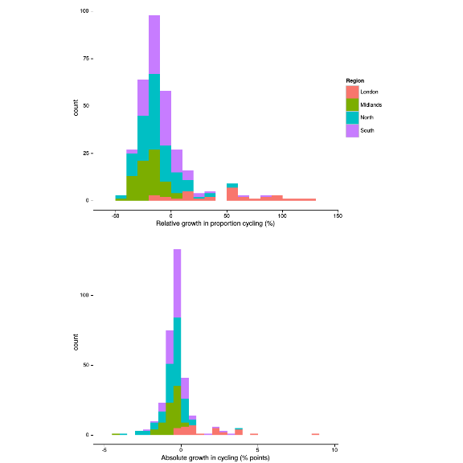
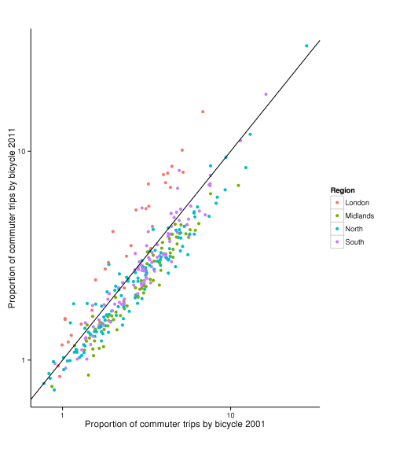

<!--Investment in cycling infrastructure growth in bicycle commuting: what's the link? -->
An exploration of factors driving changes in cycle commuting in England between 2001 and 2011: investment, infrastructure and road safety
========================================================

# Introduction

Cycling has many benefits. These include,
<!--For the following bullets:\citep{Oja2011,Rojas-rueda2011,Saunders2013,}
\citep{borjesson2010value}
\citep{Jarrett2012,Rutter2013}
saelensminde2004cost semlyen2005cutting
-->

- improved health of cyclists
([Oja, 2011](http://www.fietsersbond.be/sites/default/files/Heath%20benefits%20of%20cycling%20REVIEW%20%28Oja%202011%29.pdf);
[Rojas-Rueda et al., 2011](http://www.creal.cat/media/upload/pdf/articledavidrojas_editora_2_217_1.pdf);
[Saunders et al., 2013](http://dx.plos.org/10.1371/journal.pone.0069912)).

- economic benefits at the individual level, for example due to lower trip times ([Borjesson and Jonas, 2011](http://www.researchgate.net/publication/228341559_The_value_of_time_and_external_benefits_in_bicycle_cost-benefit_analysEs/file/e0b495165b88274e0c.pdf)),
and reduced car use (Semlyen, 2005).

- economic benefits for society at large via reduced public health bills ([Rutter et al. 2013](http://www.sciencedirect.com/science/article/pii/S0749379712007301);
Jarrett et al. 2012) and wider impacts (Cavill et al., 2008; Krizek, 2007; Saelensminde, 2004).

- environmental benefits including lower greenhouse gas emissions and demand for roads
and motor vehicles ([Lenzen, 1999](http://www.sciencedirect.com/science/article/B6VH8-3WMK47K-4/2/707d71a2636a20c4e40d703ae128b1c7);
[Lindsay and Macmillan, 2011](http://onlinelibrary.wiley.com/doi/10.1111/j.1753-6405.2010.00621.x/abstract;jsessionid=111BFA6034AF092673E1C985C07238E8.f01t04?deniedAccessCustomisedMessage=&userIsAuthenticated=false);
[Lovelace et al., 2011](http://linkinghub.elsevier.com/retrieve/pii/S0301421511000620)).

- reduction in congestion during rush hour - this is a particular benefit of cycle commuting
(as opposed to leisure cycling) via improved traffic flow (Arnott et al., 2005; Downs, 2004).

- bicycles pose a lower risk to other road users than do cars, with benefits for
social equality (Jacobsen et al., 2009; Furness, 2010).

- 'wide boundary' impacts including heightened sociability of public space and
the hope that society may one day be able to operate without burning valuable finite resources
(Furness, 2010).

Due in part to these benefits, there has been
a noticeable increase in political commitment to cycling in many countries
in recent years.
<!--\citep{} -->
In the UK, for example, Prime Minister David 
Cameron announced that "we want to see cycling soar"
([Prime Minister's Office, 2013](https://www.gov.uk/government/news/government-shifts-cycling-up-a-gear))
as well as providing
a more specific statement of intent: "This government wants to make it easier and safer for people who already cycle
as well as encouraging far more people to take it up" (ibid).

Within this context of widespread political and evidence-based
support of policies to promote modal shift to cycling, a major barrier is specific
evidence on the effectiveness of different interventions. Clearly, the number of new cyclists
resulting from a specific policy intervention cannot precisely be known. However,
using an analogy from medicine, 'dose-response' type studies can greatly help
predict the impact of planned interventions.
<!--\citep{}-->
Transport planning is a long-term process with even longer-term impacts
and such evidence can aid the strategic decision making process (Schweizer and Rupi, 2014)
With limited public funds, it is critical to
maximise the cost-effectiveness ratio of cycle-related expenditure.

More numerous and rigorous studies

could therefore help increase the rate of cycling in
many areas, assuming that funding and political will are abundant.

The purpose of this paper is to help fill this knowledge gap by analysising the change in
bicycle commuting across administrative zones across the UK. A geographically weighted regression
methodology will be used to estimate how effective different types of intervention - including
investment from the Cycling Demonstration Towns (CDT) initiative and number of cycle paths - have been.

# Literature on the spatial distribution of cycling

The Census travel to work statistics have been used in a number of studies
to shed light on the spatial distribution of travel patterns overall.

However, the number of studies focussed on active travel, and cycling in particular,
is much lower. Goodman (2013) provides a detailed and up-to-date account of
the spatial distribution of walking and cycling at the national level across England and Wales
and describes how it has changed between 2001 and 2011. The overall
rate of walking and cycling to work was found to have changed little, but important
important regional differences were identified: at the regional and local authority level
cycling growth was largely concentrated in high density urban centres, notably London and Bristol.
The paper also provided new insight into the shifting social distribution of travel to work mode:
affluence is associated with motorised modes, although this association is weakening.
Walking and cycling was found to have grown most in the least deprived areas, with car use
tending to fall in the wealthiest areas (Goodman 2013).
The underlying reasons for these shifts was not explored:
"Future analyses could also explore associations with
geographic factors such as hilliness, climate and land use patterns;
although outside the scope of this paper, these may play a key role
in explaining local and regional variation" (Goodman, 2013, p.9).
The present paper follows this suggestion by exploring the
factors associated with growth in bicycle commuting.

Multivariate regression models have been used to help explain
the spatially uneven distribution of the proportion of commutes
made by bicycle. Parkin et al. (2007) used a logistic regression model
to identify the most important factors related to cycling at the ward
level in England and Wales. 81% of the variability in the proportion
of commuters cycling to work could be explained by the model. The proportion
of white male commuters (positive), number of cars per household (negative)
and income deprivation (negative) were found to be powerful socio-economic
explanatory variables. Interestingly, hilliness was found to have a negative
impact on cycle commuting in the model. Road traffic (via the proxy 'transport
demand intensity') was negatively related to cycling to work whereas the proportion
of off-road routes had a positive impact. These latter findings
indicating transport infrastructure is an important policy
area for encouraging cycling.

Another useful output from this paper was the estimation of a 'saturation point',
referred to as 'carrying capacity' in population ecology (Lovelace et al 2011),
a theoretical upper limit on the proportion of people cycling to work in any particular
area. This was calculated to be 43% of trips, higher than any wards in the UK, but comparable
with the proportion cycling to work in some Dutch areas (Parkin et al. 2011)

# Data

Census data on commuting provide the highest spatial resolution of
transport data in the UK, down to the level of Output Areas, consisting
of roughly 100 households each. The decadal Census of population also has the highest response
rate and number of participants of any national survey, due to the nationwide coverage
of the census and the legal requirement to complete it. Offering many opportunities
to transport researchers. The downsides to census data are that it only incorporates one
reason for trip (commuting) and its poor temporal resolution. However, recent work
shows that the modal split for commuting is highly correlated with
modal split for all trips (r > 0.9 for private modes and public transport, dropping to r = 0.77
for cycling), suggesting that commuting is a reasonable proxy for travel behaviour overall
(Goodman2013). In addition, the annual publication of results from the [National
Travel Survey](https://www.gov.uk/government/collections/national-travel-survey-statistics)
provide higher temporal resolution to complement the 10 year cycle of the census.

The input data for this study were tables of commuter mode share by administrative zone
between the 2001 and 2011 Census of population. In line with the principle of parsimony,
the modelling approach was to start simple (with large geographical zones)
and move to analyse higher resolution spatial datasets as the analysis progressed.

A data problem that had to be overcome early in the analysis was the conversion
of 2001 354 Local and Unitary Authorities (combined with the 'merge' function in QGIS)
into 2011 local authority areas (LAs),
composed of English Districts, Unitary Authorities and London Boroughs.
As shown in Fig. x, there are 8 2011 LAs which encapsulate
many (38) 2001 administrative zones.
The result of this process of spatial aggregation was all 324
'lower tier' 2011 LAs, for which the
travel to work data was directly comparable between 2001 and 2011.

 

The other scales of analysis used in this study were Medium Super Output
Areas and Lower Super Output Areas (MSOAs and LSOAs with average
working populations of x and y people, respectively).
The smallest administrative geography in England is the Output Area
which contain on average around 100 households. These were omitted from
the analysis because small values are "randomly adjusted "
in the Census tables for low counts (Lovelace, 2014;
see for example http://www.nomisweb.co.uk/livelinks/4652.xls ).

The data pre-processing for these areas was simpler as there has been less
change between 2001 and 2011 for Output Areas than other types of adminstrative
geography. Of the xx 2001 MSOAs, xx were also found in the 2011 dataset. The remaining
zones were allocated to new areas in which there was more than a 90% spatial overlap
between 2001 and 2011 zones and the remainder were left as NAs. This led to xx 2011
MSOA zones for which the change in the proportion of commuters using bicycles as their
primary mode of transport to work was known. The process was used to process the LSOA
level data, resulting in xx LSOA zones containing data from both the 2001 and 2011 Census.

# Method

The proportion of people cycling to work was calculated as the total number
of people reporting travelling to work by bicycle divided the number
of people travelling by all modes. The categories of "unemployed"
and "work from home" were deliberately avoided, to prevent changes in employment
structure influencing the result: if a commuter belt shifted towards 'teleworking'
(working from home), for example, this method would provide an unfairly optimistic
impression of the uptake of cycling.

The dependent variable, *change* in the proportion of people cycling to work,
was defined in two ways. First, the absolute difference in the percentage
of people cycling to work was calculated by subtracting the 2011 results from
the 2001 results. Under this method, for example, 

# Results

The rate of cycling between 2001 and 2011 census was found to have changed
very little, being 3.1% in both cases. However, there was substantial variation
between the zones in terms of change in cycling.
There is a strong positive skew in the distribution the growth rate
(fig. x): less than a quarter (74) of LAs saw the modal share of cycling rise, by an average of 30%
whereas the majority of LAs (250) saw small declines in the proportion of
people cycling. 

In terms of absolute growth, the distribution is more
symetrical, with the vast majority of zones (264 zones, 81%) seeing less than a 1% change
either way in absolute proportion of people cycling to work.
These results are plotted geographically in fig. x.

 

 

It is interesting to note that the average cycling rate in 2001
was lower for zones where cycling dropped (3.3 %) compared with zones where cycling grew (3.7%).
Indeed, the spread in the values of pCycle grew from 2.5 percentage points in 2001 to
2.7 in 2011. Far from cycling becoming more accessible to everyone everywhere, these
results provide some geographical evidence
for a divergence between the cycling 'haves' and 'have nots'. Spatial inequality in
cycling as a mode of travel to work in recent years in England, supporting the
hypothesis of positive feedback loops in modal shift to cycling through
'strength in numbers' and the normalisation of cycling culture
(borjesson2012benefits, goetzke2011bicycle).

The regional distribution of growth in cycling, with its focus on
London, is also evident from fig x, which shows the expected
high correlation between the percent cycling to work in 2001 and 2011
(r-squared = 0.82).
The $x = y$ line in fig x represents the 'break even' point
above which cycling has grown and below which it has dropped.Thus
there are 74 points above the line and the rest fall below.
The further points are located from this break even line the more cycling has
changed in that area. The colors illustrate that many of the zones with the greatest growth
in cycling are located within the Greater London Authority.

 

The regional pattern represented by the colors in fig. x
is emphasised in in table x, which shows that
outside London there were falls in the proportion
of people cycling to work, with the greatest declines
in the Midlands and the North: the average LA in the Midlands
saw the proportion of people cycling to work drop by a fifth.

Table x: regional differences in the change in cycling as a commuter mode in England, 2001 to 2011.

|Region    |Relative change|Absolute change|
|:---------|-----------:|-----------:|
|London    |   47.4|   1.6|
|Midlands  |  -19.7|  -0.7|
|North     |  -12.3|  -0.5|
|South     |   -7.8|  -0.2|

Because of this apparent "London exceptionalism",
the analysis was re-run with London removed.
It was found that outside London, the proportion of
all people cycling to work dropped substantially, from
3.2% in 2001 to 2.9% in 2011. *The average LA outside London
saw a 12% drop in the proportion of people cycling*. These results
suggest that attempts to 'get Britain cycling' have so far failed
outside of the capital, which has seen the country's only
large 'congestion charge' scheme encourage active travel
(nakamura2014economic).

Some urban areas outside London broke the trend, seeing cycling
as a mode of travel to work grow, yet only
in 12 zones did the cycling to work increase by more than half a percentage point.
(These were, in descending order of growth rate, were Cambridge, 
Bristol, Oxford, Brighton, Exeter, Newcastle, South Cambridgeshire, South Gloucestershire,
Manchester, Sheffield and Bournemouth.) Of these, only 5 had growth rates above
1 percent. In the name of balance, it was decided to focus equally on the areas
where cycling has fallen greatly: there is a tendency towards picking 'best case'
studies in the cycling literature. This can be seen as analogous to
the disproportionate non-publication of medical trials that have negative results:
it is important to focus on 'failures' as well as 'success stories' to provide
impartial evidence to policy makers ([Jones et al., 2013](http://www.bmj.com/content/347/bmj.f6104?tab=citation)).

Table x presents the growth in cycling in the top 5 and bottom
5 areas in terms of absolute shift in the proportion of people cycling
to work. It is noticeable that while 4 of the top 5 received central government funding
between 2001 and 2011 from the CDT initiative, none of the bottom 5 did.
(Oxford is conspicuously missing from the list of CDT beneficiaries,
and some cycle campaigners have accused the local council of
failing to properly maintain the city's existing cycle infrastructure
([Horne, 2008](http://www.oxfordmail.co.uk/news/2296153.print/)).)
This suggests that, in addition to investment helping to increase the rate of cycling,
it can also serve to maintain it and prevent declines in areas that have an
already high rate of cycling.

Table x: Statistics on cycle commuting from the top 5 and bottom 5 local authorities in
England in terms of the absolute change in the proportion of commuters cycling to work.
Note

|Local Authority             |  pCycle 2001|  pCycle 2011|  Absolute growth|  Rel. growth| CDT  |
|:----------------------------|---------:|-------:|-----------:|-------:|:---------|
|Cambridge                    |      28.3|    31.9|         3.6|    12.7|2009      |
|Bristol, City of             |       4.9|     8.1|         3.1|    63.7|2009       |
|Oxford                       |      16.2|    18.7|         2.5|    15.5|No       |
|Brighton and Hove            |       3.0|     5.3|         2.4|    80.1|2005       |
|Exeter                       |       4.8|     6.6|         1.8|    37.3|2005       |
|                       |       |     |         |    |       |
|:----------------------------|---------:|-------:|-----------:|-------:|:---------|
|Boston                       |      11.1|     6.9|        -4.3|   -38.4|No       |
|Kingston upon Hull, City of  |      12.3|     8.3|        -4.0|   -32.2|No       |
|Waveney                      |       9.3|     6.5|        -2.7|   -29.6|No       |
|Fenland                      |       7.4|     4.9|        -2.6|   -34.4|No       |
|North East Lincolnshire      |       8.2|     5.6|        -2.6|   -31.2|No       |

