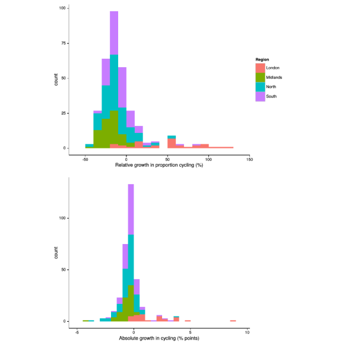
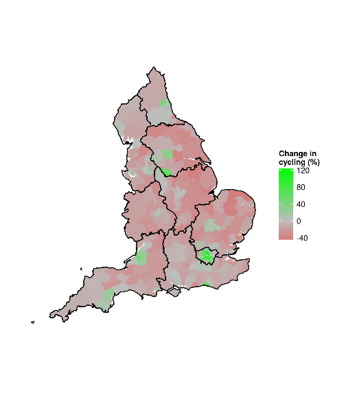
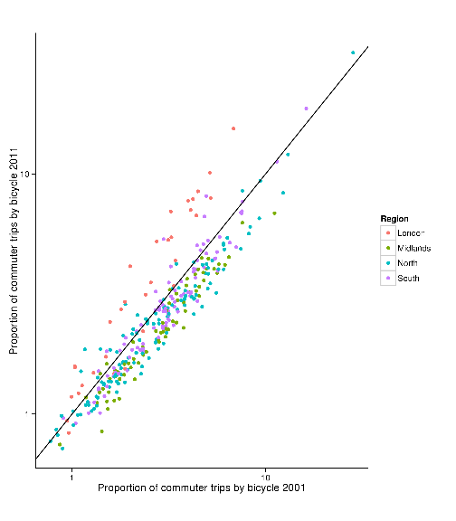

Cycling uptake across the UK
========================================================


```r
library(rgdal)
```

```
## Loading required package: sp
## rgdal: version: 0.8-14, (SVN revision 496)
## Geospatial Data Abstraction Library extensions to R successfully loaded
## Loaded GDAL runtime: GDAL 1.9.2, released 2012/10/08
## Path to GDAL shared files: /usr/share/gdal
## Loaded PROJ.4 runtime: Rel. 4.8.0, 6 March 2012, [PJ_VERSION: 480]
## Path to PROJ.4 shared files: (autodetected)
```

```r
la01 <- readOGR("updata/", "ua2001")
```

```
## OGR data source with driver: ESRI Shapefile 
## Source: "updata/", layer: "ua2001"
## with 354 features and 23 fields
## Feature type: wkbPolygon with 2 dimensions
```

```r
head(la01@data)
```

```
##   ZONE_CODE           ZONE_LABEL SUPERGROUP               LABEL AC_GROUP
## 0      00AA       City of London          3       London Centre      3.5
## 1      00AB Barking and Dagenham          1 Cities and Services      1.2
## 2      00AC               Barnet          2      London Suburbs      2.4
## 3      00AD               Bexley          5       Prospering UK      5.8
## 4      00AE                Brent          4 London Cosmopolitan      4.6
## 5      00AF              Bromley          1 Cities and Services      1.3
##                      LABEL1 SUBGROUP                        LABEL0
## 0             London Centre    3.5.8             London Centre - A
## 1     Centres with Industry    1.2.3     Centres with Industry - B
## 2            London Suburbs    2.4.6            London Suburbs - A
## 3     New and Growing Towns   5.8.15     New and Growing Towns - A
## 4       London Cosmopolitan   4.6.11       London Cosmopolitan - B
## 5 Thriving London Periphery    1.3.5 Thriving London Periphery - B
##   KS0150001 KS0150002 KS0150003 KS0150004 KS0150005 KS0150006 KS0150007
## 0      4290       432       937       149       214        30       263
## 1     65864      4010     10469      7192      6933      1032     27006
## 2    145920     15467     33433      7631     12906      1661     59224
## 3    103629      7537       906     24757      7740      2018     48467
## 4    118704     10886     30793      7328     15273      1139     39643
## 5    141497     12653      2826     39030      9547      2109     59775
##   KS0150008 KS0150009 KS0150010 KS0150011 KS0150012 KS0150013 KS0150014
## 0        14        77        74      2049        51        -1       491
## 1      2864       507      1021      4665       165        -1     17554
## 2      4071       898      1351      8772       506        -1     40115
## 3      4126       907      1039      5878       254        -1     28243
## 4      3222       464      1933      7614       409        -1     33681
## 5      4235       741      1333      8792       456        -1     42792
##   KS0150015
## 0       736
## 1      6968
## 2     13739
## 3      5156
## 4     19570
## 5      8583
```

```r

names(la01)[9:20] <- c("All", "Mfh", "Tram", "Train", "Bus", "Moto", "Car.d", 
    "Car.p", "Taxi", "Cycle", "Walk", "Other")
la01$pCycle <- la01$Cycle/la01$All
la01@data[la01$pCycle > 0.1, ]  # do these seem like cycling towns? - YES!
```

```
##     ZONE_CODE                  ZONE_LABEL SUPERGROUP
## 76       12UB                   Cambridge          1
## 96       15UH             Isles of Scilly        N/A
## 156      24UF                     Gosport          5
## 204      32UB                      Boston          5
## 246      38UC                      Oxford          1
## 317      00FA Kingston upon Hull, City of          7
## 321      00FF                        York          5
##                                                  LABEL AC_GROUP
## 76                                 Cities and Services      1.3
## 96  Zone merged into 15UF Penwith - See http://census.      N/A
## 156                                      Prospering UK      5.8
## 204                                      Prospering UK      5.7
## 246                                Cities and Services      1.3
## 317                           Mining and Manufacturing     7.11
## 321                                      Prospering UK      5.7
##                                                 LABEL1 SUBGROUP
## 76                           Thriving London Periphery    1.3.4
## 96  Zone merged into 15UF Penwith - See http://census.      N/A
## 156                              New and Growing Towns   5.8.15
## 204                           Prospering Smaller Towns   5.7.13
## 246                          Thriving London Periphery    1.3.4
## 317                             Industrial Hinterlands  7.11.20
## 321                           Prospering Smaller Towns   5.7.12
##                                                 LABEL0   All  Mfh Tram
## 76                       Thriving London Periphery - A 49236 4217   95
## 96  Zone merged into 15UF Penwith - See http://census.  1273  295    3
## 156                          New and Growing Towns - A 37295 2530   35
## 204                       Prospering Smaller Towns - B 25066 2391   15
## 246                      Thriving London Periphery - A 60093 5068  116
## 317                         Industrial Hinterlands - A 95957 5196   38
## 321                       Prospering Smaller Towns - A 87305 6871   57
##     Train   Bus Moto Car.d Car.p Taxi Cycle  Walk Other KS0150013
## 76   1523  2549  609 18441  1827  157 12758  6890   170        -1
## 96      4     4   32   224    26    6   152   499    28        -1
## 156   467  2441  866 19595  2310  183  3977  4396   495        -1
## 204    69   449  375 14709  2015   73  2523  2311   136        -1
## 246  1079  9814  637 22638  2533  209  8927  8826   246        -1
## 317   583 12294 1476 45626  7817 1187 11181  9960   599        -1
## 321  1343  6313 1531 42065  4799  440 10508 13049   329        -1
##     KS0150014 KS0150015 pCycle
## 76       2748      1284 0.2591
## 96          7         3 0.1194
## 156      2023       856 0.1066
## 204       413       104 0.1007
## 246      7409      3320 0.1486
## 317      7421      5459 0.1165
## 321      5739      1829 0.1204
```

```r

la11 <- readOGR("updata/", "ua2011")
```

```
## OGR data source with driver: ESRI Shapefile 
## Source: "updata/", layer: "ua2011"
## with 326 features and 3 fields
## Feature type: wkbPolygon with 2 dimensions
```

```r
head(la11@data)  # no data for Scotland
```

```
##        CODE                  NAME ALTNAME
## 0 E06000002         Middlesbrough    <NA>
## 1 E07000153             Kettering    <NA>
## 2 E07000164             Hambleton    <NA>
## 3 E06000025 South Gloucestershire    <NA>
## 4 E07000148               Norwich    <NA>
## 5 E07000223                  Adur    <NA>
```

```r
length(la11)  # 326 las in England
```

```
## [1] 326
```

```r
la11.data <- read.csv("updata/all-modes-la-Data_AGE_MTTWRK_UNIT.csv")
head(la11.data[1:6])
```

```
##   CDU_ID GEO_CODE  GEO_LABEL          GEO_TYPE GEO_TYP2
## 1     NA                                               
## 2     52     95AA     Antrim Local Authorities       LA
## 3     53     95BB       Ards Local Authorities       LA
## 4     54     95CC     Armagh Local Authorities       LA
## 5     55     95DD  Ballymena Local Authorities       LA
## 6     56     95EE Ballymoney Local Authorities       LA
##                                                                                                        F560
## 1 Age : Age 16 to 74 - Travel to work; means of : All categories: Method of travel to work - Unit : Persons
## 2                                                                                                          
## 3                                                                                                          
## 4                                                                                                          
## 5                                                                                                          
## 6
```

```r
la11.data <- la11.data[!la11.data$F560 == "", ]  # remove na values
la11.data <- la11.data[!grepl("W", la11.data$GEO_CODE), ]  # remove welsh areas
la11.names <- la11.data[1, ]
la11.names[6:18]
```

```
##                                                                                                        F560
## 1 Age : Age 16 to 74 - Travel to work; means of : All categories: Method of travel to work - Unit : Persons
##                                                                                           F561
## 1 Age : Age 16 to 74 - Travel to work; means of : Work mainly at or from home - Unit : Persons
##                                                                                                    F562
## 1 Age : Age 16 to 74 - Travel to work; means of : Underground; metro; light rail; tram - Unit : Persons
##                                                                     F563
## 1 Age : Age 16 to 74 - Travel to work; means of : Train - Unit : Persons
##                                                                                     F564
## 1 Age : Age 16 to 74 - Travel to work; means of : Bus; minibus or coach - Unit : Persons
##                                                                    F565
## 1 Age : Age 16 to 74 - Travel to work; means of : Taxi - Unit : Persons
##                                                                                            F566
## 1 Age : Age 16 to 74 - Travel to work; means of : Motorcycle; scooter or moped - Unit : Persons
##                                                                                    F567
## 1 Age : Age 16 to 74 - Travel to work; means of : Driving a car or van - Unit : Persons
##                                                                                         F568
## 1 Age : Age 16 to 74 - Travel to work; means of : Passenger in a car or van - Unit : Persons
##                                                                       F569
## 1 Age : Age 16 to 74 - Travel to work; means of : Bicycle - Unit : Persons
##                                                                       F570
## 1 Age : Age 16 to 74 - Travel to work; means of : On foot - Unit : Persons
##                                                                                              F571
## 1 Age : Age 16 to 74 - Travel to work; means of : Other method of travel to work - Unit : Persons
##                                                                                 F572
## 1 Age : Age 16 to 74 - Travel to work; means of : Not in employment - Unit : Persons
```

```r
names(la11.data)[c(2, 6:18)] <- c("CODE", "All", "Mfh", "Tram", "Train", "Bus", 
    "Taxi", "Moto", "Car.d", "Car.p", "Cycle", "Walk", "Other", "Unemp")
la11.data <- la11.data[-1, ]  # remove names row
head(la11.data)
```

```
##    CDU_ID      CODE            GEO_LABEL          GEO_TYPE GEO_TYP2    All
## 28     78 E06000001           Hartlepool Local Authorities       LA  66804
## 29     79 E06000002        Middlesbrough Local Authorities       LA 100551
## 30     80 E06000003 Redcar and Cleveland Local Authorities       LA  99177
## 31     81 E06000004     Stockton-on-Tees Local Authorities       LA 140654
## 32     82 E06000005           Darlington Local Authorities       LA  76635
## 33     83 E06000006               Halton Local Authorities       LA  92708
##     Mfh Tram Train  Bus Taxi Moto Car.d Car.p Cycle Walk Other Unemp
## 28 1045   33   481 2592  700  180 23871  3214   723 4514   414 29037
## 29 1306   44   718 4975  957  197 32508  4745  1397 7063   637 46004
## 30 1742   43  1193 3372  414  259 37919  4054   894 5731   733 42823
## 31 2847  102  1166 5115  642  417 60422  6160  1715 7518  1018 53532
## 32 2019   34   862 3430  441  193 30531  3400  1170 6625   309 27621
## 33 1541   38  1106 3843  350  355 39306  4071  1217 5437   313 35131
```

```r

length(which(la11.data$CODE %in% la11$CODE))
```

```
## [1] 322
```

```r
la11.data[!(la11.data$CODE %in% la11$CODE), 1:10]
```

```
##     CDU_ID      CODE                  GEO_LABEL          GEO_TYPE GEO_TYP2
## 350    400 E41000052   Cornwall,Isles of Scilly Local Authorities       LA
## 351    401 E41000324 City of London,Westminster Local Authorities       LA
##        All   Mfh  Tram Train   Bus
## 350 390480 21362   220  2464  5961
## 351 181812 10056 37834  5495 16666
```

```r

# substituting cornwall's code
la11@data[grepl("Corn", la11$NAME), ]
```

```
##          CODE     NAME ALTNAME
## 198 E06000052 Cornwall    <NA>
```

```r
la11.data[grepl("Corn", la11.data$GEO_LABEL), ]  # that's cornwall
```

```
##     CDU_ID      CODE                GEO_LABEL          GEO_TYPE GEO_TYP2
## 350    400 E41000052 Cornwall,Isles of Scilly Local Authorities       LA
##        All   Mfh Tram Train  Bus Taxi Moto  Car.d Car.p Cycle  Walk Other
## 350 390480 21362  220  2464 5961  743 2909 157998 12931  4159 34619  2472
##      Unemp
## 350 144642
```

```r
plot(la11[grepl("Corn", la11$NAME), ])  # it's definitely cornwall!
```

 

```r
la11.data$CODE <- as.character(la11.data$CODE)
la11.data$CODE[grepl("Corn", la11.data$GEO_LABEL)] <- "E06000052"

# Westminster
la11@data[grepl("Westm", la11$NAME), ]
```

```
##          CODE        NAME ALTNAME
## 296 E09000033 Westminster    <NA>
```

```r
la11.data[grepl("Westm", la11.data$GEO_LABEL), ]  # different code
```

```
##     CDU_ID      CODE                  GEO_LABEL          GEO_TYPE GEO_TYP2
## 351    401 E41000324 City of London,Westminster Local Authorities       LA
##        All   Mfh  Tram Train   Bus Taxi Moto Car.d Car.p Cycle  Walk Other
## 351 181812 10056 37834  5495 16666 1668 1356 10644   880  5617 24104  1606
##     Unemp
## 351 65886
```

```r
la11.data$CODE[grepl("Westm", la11.data$GEO_LABEL)] <- "E09000033"

la11@data[!(la11$CODE %in% la11.data$CODE), ]  # check shapes not in data
```

```
##          CODE            NAME ALTNAME
## 142 E06000053 Isles of Scilly    <NA>
## 178 E09000001  City of London    <NA>
```

```r
la11 <- la11[-which(grepl("Scilly|City of L", la11$NAME)), ]
plot(la11)
```

 

```r

head(la11.data)
```

```
##    CDU_ID      CODE            GEO_LABEL          GEO_TYPE GEO_TYP2    All
## 28     78 E06000001           Hartlepool Local Authorities       LA  66804
## 29     79 E06000002        Middlesbrough Local Authorities       LA 100551
## 30     80 E06000003 Redcar and Cleveland Local Authorities       LA  99177
## 31     81 E06000004     Stockton-on-Tees Local Authorities       LA 140654
## 32     82 E06000005           Darlington Local Authorities       LA  76635
## 33     83 E06000006               Halton Local Authorities       LA  92708
##     Mfh Tram Train  Bus Taxi Moto Car.d Car.p Cycle Walk Other Unemp
## 28 1045   33   481 2592  700  180 23871  3214   723 4514   414 29037
## 29 1306   44   718 4975  957  197 32508  4745  1397 7063   637 46004
## 30 1742   43  1193 3372  414  259 37919  4054   894 5731   733 42823
## 31 2847  102  1166 5115  642  417 60422  6160  1715 7518  1018 53532
## 32 2019   34   862 3430  441  193 30531  3400  1170 6625   309 27621
## 33 1541   38  1106 3843  350  355 39306  4071  1217 5437   313 35131
```

```r
head(la11@data)
```

```
##        CODE                  NAME ALTNAME
## 0 E06000002         Middlesbrough    <NA>
## 1 E07000153             Kettering    <NA>
## 2 E07000164             Hambleton    <NA>
## 3 E06000025 South Gloucestershire    <NA>
## 4 E07000148               Norwich    <NA>
## 5 E07000223                  Adur    <NA>
```

```r
la11@data <- join(la11@data, la11.data)
```

```
## Joining by: CODE
```

```r
head(la11@data)
```

```
##        CODE                  NAME ALTNAME CDU_ID             GEO_LABEL
## 1 E06000002         Middlesbrough    <NA>     79         Middlesbrough
## 2 E07000153             Kettering    <NA>    261             Kettering
## 3 E07000164             Hambleton    <NA>    266             Hambleton
## 4 E06000025 South Gloucestershire    <NA>    102 South Gloucestershire
## 5 E07000148               Norwich    <NA>    256               Norwich
## 6 E07000223                  Adur    <NA>    320                  Adur
##            GEO_TYPE GEO_TYP2    All  Mfh Tram Train  Bus Taxi Moto Car.d
## 1 Local Authorities       LA 100551 1306   44   718 4975  957  197 32508
## 2 Local Authorities       LA  67920 2281   35   845 1297  105  286 32797
## 3 Local Authorities       LA  65255 4040   39   580  698  103  197 29289
## 4 Local Authorities       LA 192468 6479  100  1724 6743  263 1906 95258
## 5 Local Authorities       LA 100702 2530   89   777 5035  308  706 28792
## 6 Local Authorities       LA  43860 1558   30  2222 1648  102  366 18121
##   Car.p Cycle  Walk Other Unemp
## 1  4745  1397  7063   637 46004
## 2  2977   850  5236   209 21002
## 3  2147  1250  6566   346 20000
## 4  6948  5356 11150   604 55937
## 5  3257  5600 14887   443 38278
## 6  1545  1115  2472   177 14504
```

```r

# convert to numbers
la11@data[!grepl("[1-9]", la11$Train), ]
```

```
##  [1] CODE      NAME      ALTNAME   CDU_ID    GEO_LABEL GEO_TYPE  GEO_TYP2 
##  [8] All       Mfh       Tram      Train     Bus       Taxi      Moto     
## [15] Car.d     Car.p     Cycle     Walk      Other     Unemp    
## <0 rows> (or 0-length row.names)
```

```r
head(la11@data)
```

```
##        CODE                  NAME ALTNAME CDU_ID             GEO_LABEL
## 1 E06000002         Middlesbrough    <NA>     79         Middlesbrough
## 2 E07000153             Kettering    <NA>    261             Kettering
## 3 E07000164             Hambleton    <NA>    266             Hambleton
## 4 E06000025 South Gloucestershire    <NA>    102 South Gloucestershire
## 5 E07000148               Norwich    <NA>    256               Norwich
## 6 E07000223                  Adur    <NA>    320                  Adur
##            GEO_TYPE GEO_TYP2    All  Mfh Tram Train  Bus Taxi Moto Car.d
## 1 Local Authorities       LA 100551 1306   44   718 4975  957  197 32508
## 2 Local Authorities       LA  67920 2281   35   845 1297  105  286 32797
## 3 Local Authorities       LA  65255 4040   39   580  698  103  197 29289
## 4 Local Authorities       LA 192468 6479  100  1724 6743  263 1906 95258
## 5 Local Authorities       LA 100702 2530   89   777 5035  308  706 28792
## 6 Local Authorities       LA  43860 1558   30  2222 1648  102  366 18121
##   Car.p Cycle  Walk Other Unemp
## 1  4745  1397  7063   637 46004
## 2  2977   850  5236   209 21002
## 3  2147  1250  6566   346 20000
## 4  6948  5356 11150   604 55937
## 5  3257  5600 14887   443 38278
## 6  1545  1115  2472   177 14504
```

```r
for (i in 8:20) {
    la11@data[, i] <- as.numeric(as.character(la11@data[, i]))
}

```


We have now loaded the data at the LA level for 2001 and 2011 modal split data.
Are the proportions generated realistic?


```r
names(la11)
```

```
##  [1] "CODE"      "NAME"      "ALTNAME"   "CDU_ID"    "GEO_LABEL"
##  [6] "GEO_TYPE"  "GEO_TYP2"  "All"       "Mfh"       "Tram"     
## [11] "Train"     "Bus"       "Taxi"      "Moto"      "Car.d"    
## [16] "Car.p"     "Cycle"     "Walk"      "Other"     "Unemp"
```

```r
sum(la11@data[8]) - sum(la11@data[9:19])
```

```
## [1] 13718653
```

```r
sum(la11$Unemp)
```

```
## [1] 13718653
```

```r
sum(la11$All) - sum(la11$Unemp)
```

```
## [1] 25162721
```

```r
sum(la01$All)  # this shows the 'All' category includes unemployed. Rm them!
```

```
## [1] 22441500
```

```r
la11$All <- la11$All - la11$Unemp
sum(la11$All)/sum(la01$All)  # 12% growth - sounds about right
```

```
## [1] 1.121
```

```r

la11$pCycle <- la11$Cycle/la11$All
la11@data[la11$pCycle > 0.1, ]  # do these seem like cycling towns? - YES!
```

```
##          CODE      NAME ALTNAME CDU_ID GEO_LABEL          GEO_TYPE
## 36  E07000178    Oxford    <NA>    280    Oxford Local Authorities
## 58  E07000008 Cambridge    <NA>    136 Cambridge Local Authorities
## 154 E09000012   Hackney    <NA>    379   Hackney Local Authorities
## 247 E06000014      York    <NA>     91      York Local Authorities
## 271 E07000088   Gosport    <NA>    196   Gosport Local Authorities
##     GEO_TYP2    All  Mfh  Tram Train   Bus Taxi Moto Car.d Car.p Cycle
## 36        LA  69807 4300   170  1769 11405  264  482 23735  2245 12270
## 58        LA  59437 3856   136  2912  3862  215  504 18810  1669 17755
## 154       LA 118556 6485 23424  8667 31604  551 1305 13382   914 17312
## 247       LA  98721 5025   104  2545  7141  418  968 47885  4565 11297
## 271       LA  40063 1363    22   585  2051  206  957 23821  2085  4349
##      Walk Other Unemp pCycle
## 36  12674   493 48630 0.1758
## 58   9389   329 38846 0.2987
## 154 14054   858 68867 0.1460
## 247 18246   527 51068 0.1144
## 271  4076   548 19436 0.1086
```


Let's look at the cross-comparison between LAs in 2001 and 2011.


```r
la01@data[!la01$ZONE_LABEL %in% la11$NAME, 1:5]  # now switch to qgis to merge these
```

```
##     ZONE_CODE              ZONE_LABEL SUPERGROUP
## 0        00AA          City of London          3
## 69       09UC        Mid Bedfordshire          5
## 71       09UE      South Bedfordshire          5
## 81       13UB                 Chester          5
## 82       13UC               Congleton          5
## 83       13UD      Crewe and Nantwich          5
## 84       13UE Ellesmere Port & Neston          7
## 85       13UG            Macclesfield          5
## 86       13UH              Vale Royal          5
## 87       15UB                 Caradon          6
## 88       15UC                 Carrick          6
## 89       15UD                 Kerrier          6
## 90       15UE          North Cornwall          6
## 91       15UF                 Penwith          6
## 92       15UG               Restormel          6
## 96       15UH         Isles of Scilly        N/A
## 122      20UB       Chester-le-Street          7
## 123      20UD             Derwentside          7
## 124      20UE                  Durham          5
## 125      20UF               Easington          7
## 126      20UG              Sedgefield          7
## 127      20UH                Teesdale          6
## 128      20UJ             Wear Valley          7
## 225      35UB                 Alnwick          6
## 226      35UC      Berwick-upon-Tweed          6
## 227      35UD            Blyth Valley          7
## 228      35UE          Castle Morpeth          5
## 229      35UF                Tynedale          5
## 230      35UG                Wansbeck          7
## 250      39UB              Bridgnorth          5
## 251      39UC        North Shropshire          5
## 252      39UD                Oswestry          5
## 253      39UE   Shrewsbury and Atcham          5
## 254      39UF        South Shropshire          6
## 298      46UB                  Kennet          5
## 299      46UC         North Wiltshire          5
## 300      46UD               Salisbury          5
## 301      46UF          West Wiltshire          5
##                                                  LABEL AC_GROUP
## 0                                        London Centre      3.5
## 69                                       Prospering UK      5.7
## 71                                       Prospering UK      5.7
## 81                                       Prospering UK      5.7
## 82                                       Prospering UK      5.7
## 83                                       Prospering UK      5.7
## 84                            Mining and Manufacturing     7.12
## 85                                       Prospering UK      5.7
## 86                                       Prospering UK      5.7
## 87                             Coastal and Countryside     6.10
## 88                             Coastal and Countryside     6.10
## 89                             Coastal and Countryside     6.10
## 90                             Coastal and Countryside     6.10
## 91                             Coastal and Countryside     6.10
## 92                             Coastal and Countryside     6.10
## 96  Zone merged into 15UF Penwith - See http://census.      N/A
## 122                           Mining and Manufacturing     7.12
## 123                           Mining and Manufacturing     7.11
## 124                                      Prospering UK      5.7
## 125                           Mining and Manufacturing     7.11
## 126                           Mining and Manufacturing     7.11
## 127                            Coastal and Countryside     6.10
## 128                           Mining and Manufacturing     7.11
## 225                            Coastal and Countryside     6.10
## 226                            Coastal and Countryside     6.10
## 227                           Mining and Manufacturing     7.12
## 228                                      Prospering UK      5.7
## 229                                      Prospering UK      5.7
## 230                           Mining and Manufacturing     7.11
## 250                                      Prospering UK      5.7
## 251                                      Prospering UK      5.7
## 252                                      Prospering UK      5.7
## 253                                      Prospering UK      5.7
## 254                            Coastal and Countryside     6.10
## 298                                      Prospering UK      5.9
## 299                                      Prospering UK      5.9
## 300                                      Prospering UK      5.7
## 301                                      Prospering UK      5.7
```

```r
plot(la01[!la01$ZONE_LABEL %in% la11$NAME, ])  # all zones which have changed
```

 

```r
# writeOGR(la01[! la01$ZONE_LABEL %in% la11$NAME ,], dsn='updata/',
# 'las01-not-11', 'ESRI Shapefile')
la11merge <- merge(la01@data, la11@data, by.x = "ZONE_LABEL", by.y = "NAME", 
    all.x = F)
plot(la11merge$All.x, la11merge$All.y)  # this suggests we can just rm some of the zones woop
```

 

```r
la11merge[which(la11merge$All.x/la11merge$All.y < 0.75), 1:3]
```

```
##        ZONE_LABEL ZONE_CODE SUPERGROUP
## 107       Hackney      00AM          4
## 132     Islington      00AU          3
## 153    Manchester      00BN          1
## 169        Newham      00BB          4
## 243     Southwark      00BE          4
## 277 Tower Hamlets      00BG          3
```


Merge the data from the 2001 census to fit into 2011 las.


```r
la01.pnts <- SpatialPointsDataFrame(coordinates(la01), data = la01@data)
plot(la11[grepl("Cornw", la11$NAME), ])
proj4string(la01.pnts) <- proj4string(la11)
cornwal01 <- la01.pnts[la11[grep("Cornw", la11$NAME), ], ]
points(cornwal01)
```

 

```r
corn.sel <- c(row.names(cornwal01), "96")  # include isle of scilly

la01.pnts@data <- la01@data[c(2, 9:23)]
class(la01.pnts@data$Mfh)
```

```
## [1] "numeric"
```

```r
colSums(la01.pnts@data[corn.sel, 2:16])
```

```
##       All       Mfh      Tram     Train       Bus      Moto     Car.d 
##    214262     29908       156      1350      5784      3402    124778 
##     Car.p      Taxi     Cycle      Walk     Other KS0150013 KS0150014 
##     14161       848      3770     27926      2179        -7      5461 
## KS0150015 
##      1737
```

```r
la01.pnts$ZONE_LABEL <- as.character(la01.pnts$ZONE_LABEL)
# la01.pnts@data <- rbind(la01.pnts@data, c('Cornwall,Isles of Scilly',
# colSums(la01.pnts@data[corn.sel, 2:16])))
newCornw <- SpatialPointsDataFrame(coordinates(la11[grepl("Cornw", la11$NAME), 
    ]), match.ID = F, data = data.frame(t(c(ZONE_LABEL = 1000, colSums(la01.pnts@data[corn.sel, 
    2:16])))))
proj4string(newCornw) <- proj4string(la01.pnts)

la01.pnts <- rbind.SpatialPointsDataFrame(la01.pnts, newCornw)

class(la01.pnts@data$Mfh)
```

```
## [1] "numeric"
```

```r
la01.pnts@data[nrow(la01.pnts@data), 1] <- "Cornwall"

la01.pnts <- la01.pnts[-which(row.names(la01.pnts) %in% corn.sel), ]
la11@data[grep("Cornw", la11$NAME), ]
```

```
##          CODE     NAME ALTNAME CDU_ID                GEO_LABEL
## 197 E06000052 Cornwall    <NA>    400 Cornwall,Isles of Scilly
##              GEO_TYPE GEO_TYP2    All   Mfh Tram Train  Bus Taxi Moto
## 197 Local Authorities       LA 245838 21362  220  2464 5961  743 2909
##      Car.d Car.p Cycle  Walk Other  Unemp  pCycle
## 197 157998 12931  4159 34619  2472 144642 0.01692
```

```r
la01.pnts@data[grep("Cornw", la01.pnts@data$ZONE_LABEL), ]
```

```
##     ZONE_LABEL    All   Mfh Tram Train  Bus Moto  Car.d Car.p Taxi Cycle
## 355   Cornwall 214262 29908  156  1350 5784 3402 124778 14161  848  3770
##      Walk Other KS0150013 KS0150014 KS0150015
## 355 27926  2179        -7      5461      1737
```


Merge the next zone...


```r
plot(la11)
plot(la11[grep("Wilt", la11$NAME), ], col = "red", add = T)
Wilt <- la01.pnts[la11[grep("Wilt", la11$NAME), ], ]
points(Wilt)
Wilt  # names make sense?
```

```
##          coordinates      ZONE_LABEL   All  Mfh Tram Train  Bus Moto Car.d
## 298 (415500, 161900)          Kennet 37571 4613   65   587  864  403 22201
## 299 (396600, 180800) North Wiltshire 64518 7269   78  1189 1701  793 40416
## 300 (406000, 132300)       Salisbury 57468 6420   85   932 2401  671 32509
## 301 (389300, 150100)  West Wiltshire 57721 5883   50  1082 1019  719 36304
##     Car.p Taxi Cycle Walk Other KS0150013 KS0150014 KS0150015
## 298  2269   88  1102 5137   242        -1      1281       201
## 299  3631  141  2343 6680   277        -1      2520       428
## 300  3504  131  2246 8220   349        -1      2607       765
## 301  3688  179  2194 6359   244        -1      1794       342
```

```r
Wilt <- row.names(Wilt)
la01.pnts[Wilt, ]
```

```
##          coordinates      ZONE_LABEL   All  Mfh Tram Train  Bus Moto Car.d
## 298 (415500, 161900)          Kennet 37571 4613   65   587  864  403 22201
## 299 (396600, 180800) North Wiltshire 64518 7269   78  1189 1701  793 40416
## 300 (406000, 132300)       Salisbury 57468 6420   85   932 2401  671 32509
## 301 (389300, 150100)  West Wiltshire 57721 5883   50  1082 1019  719 36304
##     Car.p Taxi Cycle Walk Other KS0150013 KS0150014 KS0150015
## 298  2269   88  1102 5137   242        -1      1281       201
## 299  3631  141  2343 6680   277        -1      2520       428
## 300  3504  131  2246 8220   349        -1      2607       765
## 301  3688  179  2194 6359   244        -1      1794       342
```

```r

newWilt <- SpatialPointsDataFrame(coordinates(la11[grepl("Wilt", la11$NAME), 
    ]), match.ID = F, data = data.frame(t(c(ZONE_LABEL = 1000, colSums(la01.pnts@data[Wilt, 
    2:16])))))
proj4string(newWilt) <- proj4string(la01.pnts)

la01.pnts <- rbind.SpatialPointsDataFrame(la01.pnts, newWilt)
la01.pnts@data[nrow(la01.pnts@data), 1] <- as.character(la11@data$NAME[grep("Wilt", 
    la11$NAME)])

nrow(la01.pnts)
```

```
## [1] 349
```

```r
la01.pnts <- la01.pnts[-which(row.names(la01.pnts) %in% Wilt), ]
nrow(la01.pnts)
```

```
## [1] 345
```

```r
la11@data[grep("Wilt", la11$NAME), ]
```

```
##         CODE      NAME ALTNAME CDU_ID GEO_LABEL          GEO_TYPE GEO_TYP2
## 80 E06000054 Wiltshire    <NA>    129 Wiltshire Local Authorities       LA
##       All   Mfh Tram Train  Bus Taxi Moto  Car.d Car.p Cycle  Walk Other
## 80 239216 17608  385  6233 6412  595 1942 154808 11725  6906 31113  1489
##     Unemp  pCycle
## 80 100379 0.02887
```

```r
la01.pnts@data[grep("Wilt", la01.pnts@data$ZONE_LABEL), ]
```

```
##      ZONE_LABEL    All   Mfh Tram Train  Bus Moto  Car.d Car.p Taxi Cycle
## 3491  Wiltshire 217278 24185  278  3790 5985 2586 131430 13092  539  7885
##       Walk Other KS0150013 KS0150014 KS0150015
## 3491 26396  1112        -4      8202      1736
```

```r
points(la01.pnts, col = "green")
```

 


Merge the next zone: Northumberland


```r
plot(la11)
plot(la11[grep("Northumb", la11$NAME), ], col = "red", add = T)
Northumb <- la01.pnts[la11[grep("Northumb", la11$NAME), ], ]
points(Northumb)
Northumb  # names make sense?
```

```
##          coordinates         ZONE_LABEL   All  Mfh Tram Train  Bus Moto
## 225 (405200, 606800)            Alnwick 13847 2021   44   108  516   74
## 226 (400500, 633200) Berwick-upon-Tweed 11460 1820   22   121  612   97
## 227 (428700, 577600)       Blyth Valley 36499 2606  309   162 3178  298
## 228 (414300, 583700)     Castle Morpeth 21128 2457  193   172  992  124
## 229 (382000, 573900)           Tynedale 27583 4120   81   482  968  116
## 230 (427000, 585400)           Wansbeck 25566 1663   66    87 2065  182
##     Car.d Car.p Taxi Cycle Walk Other KS0150013 KS0150014 KS0150015
## 225  7610   901   26   176 2210   161        -1       511       141
## 226  5403   859   45   195 2149   137        -1       500       253
## 227 21720  3897  196   801 3059   273        -1      2603      1044
## 228 13429  1494   50   237 1771   209        -1      1071       274
## 229 15935  1911   86   214 3415   255        -1      1240       288
## 230 15040  2757   98   553 2915   140        -1      1375       842
```

```r
Northumb <- row.names(Northumb)
la01.pnts[Northumb, ]
```

```
##          coordinates         ZONE_LABEL   All  Mfh Tram Train  Bus Moto
## 225 (405200, 606800)            Alnwick 13847 2021   44   108  516   74
## 226 (400500, 633200) Berwick-upon-Tweed 11460 1820   22   121  612   97
## 227 (428700, 577600)       Blyth Valley 36499 2606  309   162 3178  298
## 228 (414300, 583700)     Castle Morpeth 21128 2457  193   172  992  124
## 229 (382000, 573900)           Tynedale 27583 4120   81   482  968  116
## 230 (427000, 585400)           Wansbeck 25566 1663   66    87 2065  182
##     Car.d Car.p Taxi Cycle Walk Other KS0150013 KS0150014 KS0150015
## 225  7610   901   26   176 2210   161        -1       511       141
## 226  5403   859   45   195 2149   137        -1       500       253
## 227 21720  3897  196   801 3059   273        -1      2603      1044
## 228 13429  1494   50   237 1771   209        -1      1071       274
## 229 15935  1911   86   214 3415   255        -1      1240       288
## 230 15040  2757   98   553 2915   140        -1      1375       842
```

```r

newNorthumb <- SpatialPointsDataFrame(coordinates(la11[grepl("Northumb", la11$NAME), 
    ]), match.ID = F, data = data.frame(t(c(ZONE_LABEL = 1000, colSums(la01.pnts@data[Northumb, 
    2:16])))))
proj4string(newNorthumb) <- proj4string(la01.pnts)

la01.pnts <- rbind.SpatialPointsDataFrame(la01.pnts, newNorthumb)
la01.pnts@data[nrow(la01.pnts@data), 1] <- as.character(la11@data$NAME[grep("Northumb", 
    la11$NAME)])

nrow(la01.pnts)
```

```
## [1] 346
```

```r
la01.pnts <- la01.pnts[-which(row.names(la01.pnts) %in% Northumb), ]
nrow(la01.pnts)
```

```
## [1] 340
```

```r
la11@data[grep("Northumb", la11$NAME), ]
```

```
##          CODE           NAME ALTNAME CDU_ID      GEO_LABEL
## 239 E06000048 Northumberland    <NA>    125 Northumberland
##              GEO_TYPE GEO_TYP2    All  Mfh Tram Train  Bus Taxi Moto Car.d
## 239 Local Authorities       LA 146901 9195  674  1952 7711  588  704 96053
##     Car.p Cycle  Walk Other Unemp  pCycle
## 239  9552  2137 16924  1411 86323 0.01455
```

```r
la01.pnts@data[grep("Northumb", la01.pnts@data$ZONE_LABEL), ]
```

```
##          ZONE_LABEL    All   Mfh Tram Train  Bus Moto Car.d Car.p Taxi
## 3461 Northumberland 136083 14687  715  1132 8331  891 79137 11819  501
##      Cycle  Walk Other KS0150013 KS0150014 KS0150015
## 3461  2176 15519  1175        -6      7300      2842
```

```r
points(la01.pnts, col = "green")
```

 


Durham:


```r
plot(la11)
plot(la11[grep("Durh", la11$NAME), ], col = "red", add = T)
Durh <- la01.pnts[la11[grep("Durh", la11$NAME), ], ]
points(Durh)
Durh  # names make sense?
```

```
##          coordinates        ZONE_LABEL   All  Mfh Tram Train  Bus Moto
## 122 (426300, 551000) Chester-le-Street 24723 1921   41   177 2299  184
## 123 (412500, 548300)       Derwentside 36009 2916   37   107 3132  210
## 124 (428000, 541100)            Durham 36923 2872   49   404 3068  228
## 125 (441000, 541500)         Easington 33432 2305   32   143 2453  203
## 126 (431400, 529300)        Sedgefield 36620 2661   15   123 2513  266
## 127 (399600, 522000)          Teesdale 11063 1850    5    43  316   53
## 128 (400700, 538500)       Wear Valley 24844 2427   11    65 1546  112
##     Car.d Car.p Taxi Cycle Walk Other KS0150013 KS0150014 KS0150015
## 122 15806  2237  106   175 1643   134        -1      1731       784
## 123 21460  4042  432   226 3250   197        -1      2062      1212
## 124 21898  3499   75   392 4205   233        -1      2297      1124
## 125 19486  4203  383   295 3690   239        -1      1681       947
## 126 22125  4234  145   542 3810   186        -1      1711       939
## 127  6265   754   22    96 1569    90        -1       288        75
## 128 14650  2630   67   162 3011   163        -1      1068       554
```

```r
Durh <- row.names(Durh)
la01.pnts[Durh, ]
```

```
##          coordinates        ZONE_LABEL   All  Mfh Tram Train  Bus Moto
## 122 (426300, 551000) Chester-le-Street 24723 1921   41   177 2299  184
## 123 (412500, 548300)       Derwentside 36009 2916   37   107 3132  210
## 124 (428000, 541100)            Durham 36923 2872   49   404 3068  228
## 125 (441000, 541500)         Easington 33432 2305   32   143 2453  203
## 126 (431400, 529300)        Sedgefield 36620 2661   15   123 2513  266
## 127 (399600, 522000)          Teesdale 11063 1850    5    43  316   53
## 128 (400700, 538500)       Wear Valley 24844 2427   11    65 1546  112
##     Car.d Car.p Taxi Cycle Walk Other KS0150013 KS0150014 KS0150015
## 122 15806  2237  106   175 1643   134        -1      1731       784
## 123 21460  4042  432   226 3250   197        -1      2062      1212
## 124 21898  3499   75   392 4205   233        -1      2297      1124
## 125 19486  4203  383   295 3690   239        -1      1681       947
## 126 22125  4234  145   542 3810   186        -1      1711       939
## 127  6265   754   22    96 1569    90        -1       288        75
## 128 14650  2630   67   162 3011   163        -1      1068       554
```

```r

newDurh <- SpatialPointsDataFrame(coordinates(la11[grepl("Durh", la11$NAME), 
    ]), match.ID = F, data = data.frame(t(c(ZONE_LABEL = 1000, colSums(la01.pnts@data[Durh, 
    2:16])))))
proj4string(newDurh) <- proj4string(la01.pnts)

la01.pnts <- rbind.SpatialPointsDataFrame(la01.pnts, newDurh)
la01.pnts@data[nrow(la01.pnts@data), 1] <- as.character(la11@data$NAME[grep("Durh", 
    la11$NAME)])

nrow(la01.pnts)
```

```
## [1] 341
```

```r
la01.pnts <- la01.pnts[-which(row.names(la01.pnts) %in% Durh), ]
nrow(la01.pnts)
```

```
## [1] 334
```

```r
la11@data[grep("Durh", la11$NAME), ]
```

```
##          CODE          NAME ALTNAME CDU_ID     GEO_LABEL          GEO_TYPE
## 310 E06000047 County Durham    <NA>    124 County Durham Local Authorities
##     GEO_TYP2    All  Mfh Tram Train   Bus Taxi Moto  Car.d Car.p Cycle
## 310       LA 227894 9642  331  1948 13963 1521 1061 154210 17707  2243
##      Walk Other  Unemp   pCycle
## 310 23797  1471 155902 0.009842
```

```r
la01.pnts@data[grep("Durh", la01.pnts@data$ZONE_LABEL), ]
```

```
##         ZONE_LABEL    All   Mfh Tram Train   Bus Moto  Car.d Car.p Taxi
## 3411 County Durham 203614 16952  190  1062 15327 1256 121690 21599 1230
##      Cycle  Walk Other KS0150013 KS0150014 KS0150015
## 3411  1888 21178  1242        -7     10838      5635
```

```r
points(la01.pnts, col = "green")
```

 


Cheshire E:


```r
plot(la11)
plot(la11[grep("Cheshire E", la11$NAME), ], col = "red", add = T)
Chest <- la01.pnts[la11[grep("Cheshire E", la11$NAME), ], ]
points(Chest)
Chest  # names make sense?
```

```
##         coordinates         ZONE_LABEL   All  Mfh Tram Train  Bus Moto
## 82 (379700, 362800)          Congleton 44577 4765   28   643  623  406
## 83 (364400, 351800) Crewe and Nantwich 51527 5108   34   853 1294  811
## 85 (385600, 376400)       Macclesfield 73039 8549  122  1691 1448  451
##    Car.d Car.p Taxi Cycle Walk Other KS0150013 KS0150014 KS0150015
## 82 30977  2520   67  1057 3343   148        -1      1096       171
## 83 31265  3353  127  3517 4956   209        -1      1652       509
## 85 47911  3919  396  1193 6971   388        -1      2689       562
```

```r
Chest <- row.names(Chest)
la01.pnts[Chest, ]
```

```
##         coordinates         ZONE_LABEL   All  Mfh Tram Train  Bus Moto
## 82 (379700, 362800)          Congleton 44577 4765   28   643  623  406
## 83 (364400, 351800) Crewe and Nantwich 51527 5108   34   853 1294  811
## 85 (385600, 376400)       Macclesfield 73039 8549  122  1691 1448  451
##    Car.d Car.p Taxi Cycle Walk Other KS0150013 KS0150014 KS0150015
## 82 30977  2520   67  1057 3343   148        -1      1096       171
## 83 31265  3353  127  3517 4956   209        -1      1652       509
## 85 47911  3919  396  1193 6971   388        -1      2689       562
```

```r

newChest <- SpatialPointsDataFrame(coordinates(la11[grepl("Cheshire E", la11$NAME), 
    ]), match.ID = F, data = data.frame(t(c(ZONE_LABEL = 1000, colSums(la01.pnts@data[Chest, 
    2:16])))))
proj4string(newChest) <- proj4string(la01.pnts)

la01.pnts <- rbind.SpatialPointsDataFrame(la01.pnts, newChest)
la01.pnts@data[nrow(la01.pnts@data), 1] <- as.character(la11@data$NAME[grep("Cheshire E", 
    la11$NAME)])

nrow(la01.pnts)
```

```
## [1] 335
```

```r
la01.pnts <- la01.pnts[-which(row.names(la01.pnts) %in% Chest), ]
nrow(la01.pnts)
```

```
## [1] 332
```

```r
la11@data[grep("Cheshire E", la11$NAME), ]
```

```
##          CODE          NAME ALTNAME CDU_ID     GEO_LABEL          GEO_TYPE
## 241 E06000049 Cheshire East    <NA>    126 Cheshire East Local Authorities
##     GEO_TYP2    All   Mfh Tram Train  Bus Taxi Moto  Car.d Car.p Cycle
## 241       LA 181136 13462  262  5269 3326  582 1188 124069  9216  4761
##      Walk Other Unemp  pCycle
## 241 17939  1062 89817 0.02628
```

```r
la01.pnts@data[grep("Cheshire E", la01.pnts@data$ZONE_LABEL), ]
```

```
##         ZONE_LABEL    All   Mfh Tram Train  Bus Moto  Car.d Car.p Taxi
## 3351 Cheshire East 169143 18422  184  3187 3365 1668 110153  9792  590
##      Cycle  Walk Other KS0150013 KS0150014 KS0150015
## 3351  5767 15270   745        -3      5437      1242
```

```r
points(la01.pnts, col = "green")
```

 


Cheshire W:


```r
plot(la11)
plot(la11[grep("Cheshire W", la11$NAME), ], col = "red", add = T)
Chest <- la01.pnts[la11[grep("Cheshire W", la11$NAME), ], ]
points(Chest)
Chest  # names make sense?
```

```
##         coordinates              ZONE_LABEL   All  Mfh Tram Train  Bus
## 81 (345500, 361200)                 Chester 55383 5499   59   721 3508
## 84 (336400, 377100) Ellesmere Port & Neston 37062 2519   63   646 1527
## 86 (361400, 371600)              Vale Royal 56998 5749   61   471 1353
##    Moto Car.d Car.p Taxi Cycle Walk Other KS0150013 KS0150014 KS0150015
## 81  474 33328  3257  359  1858 5997   323        -1      3109      1161
## 84  497 23983  3284  356  1324 2656   207        -1      1700       534
## 86  624 38960  3743  124  1283 4340   290        -1      1462       420
```

```r
Chest <- row.names(Chest)
la01.pnts[Chest, ]
```

```
##         coordinates              ZONE_LABEL   All  Mfh Tram Train  Bus
## 81 (345500, 361200)                 Chester 55383 5499   59   721 3508
## 84 (336400, 377100) Ellesmere Port & Neston 37062 2519   63   646 1527
## 86 (361400, 371600)              Vale Royal 56998 5749   61   471 1353
##    Moto Car.d Car.p Taxi Cycle Walk Other KS0150013 KS0150014 KS0150015
## 81  474 33328  3257  359  1858 5997   323        -1      3109      1161
## 84  497 23983  3284  356  1324 2656   207        -1      1700       534
## 86  624 38960  3743  124  1283 4340   290        -1      1462       420
```

```r

newChest <- SpatialPointsDataFrame(coordinates(la11[grepl("Cheshire W", la11$NAME), 
    ]), match.ID = F, data = data.frame(t(c(ZONE_LABEL = 1000, colSums(la01.pnts@data[Chest, 
    2:16])))))
proj4string(newChest) <- proj4string(la01.pnts)

la01.pnts <- rbind.SpatialPointsDataFrame(la01.pnts, newChest)
la01.pnts@data[nrow(la01.pnts@data), 1] <- as.character(la11@data$NAME[grep("Cheshire W", 
    la11$NAME)])

nrow(la01.pnts)
```

```
## [1] 333
```

```r
la01.pnts <- la01.pnts[-which(row.names(la01.pnts) %in% Chest), ]
nrow(la01.pnts)
```

```
## [1] 330
```

```r
la11@data[grep("Cheshire W", la11$NAME), ]
```

```
##         CODE                      NAME ALTNAME CDU_ID
## 90 E06000050 Cheshire West and Chester    <NA>    127
##                    GEO_LABEL          GEO_TYPE GEO_TYP2    All  Mfh Tram
## 90 Cheshire West and Chester Local Authorities       LA 160138 9450  263
##    Train  Bus Taxi Moto  Car.d Car.p Cycle  Walk Other Unemp  pCycle
## 90  3262 5566  871 1033 109464  8947  4284 15987  1011 83017 0.02675
```

```r
la01.pnts@data[grep("Cheshire W", la01.pnts@data$ZONE_LABEL), ]
```

```
##                     ZONE_LABEL    All   Mfh Tram Train  Bus Moto Car.d
## 3331 Cheshire West and Chester 149443 13767  183  1838 6388 1595 96271
##      Car.p Taxi Cycle  Walk Other KS0150013 KS0150014 KS0150015
## 3331 10284  839  4465 12993   820        -3      6271      2115
```

```r
points(la01.pnts, col = "green")
```

 


Shropshire:


```r
plot(la11)
plot(la11[grep("Shrop", la11$NAME), ], col = "red", add = T)
Chest <- la01.pnts[la11[grep("Shrop", la11$NAME), ], ]
points(Chest)
Chest  # names make sense?
```

```
##          coordinates            ZONE_LABEL   All  Mfh Tram Train  Bus Moto
## 250 (370900, 293900)            Bridgnorth 27026 3575   16   244  419  177
## 251 (354700, 331300)      North Shropshire 26833 3988   14   157  364  250
## 252 (330700, 327300)              Oswestry 17219 1919    5    92  386  126
## 253 (347400, 308200) Shrewsbury and Atcham 46146 4881   24   428 2126  497
## 254 (341700, 285100)      South Shropshire 18212 3719   15   161  268  105
##     Car.d Car.p Taxi Cycle Walk Other KS0150013 KS0150014 KS0150015
## 250 15915  1632   46   601 4278   123        -1       571       105
## 251 16147  1487   70  1019 3114   223        -1       424        81
## 252 10719  1367   95   450 1954   106        -1       378       105
## 253 26929  3095  185  2377 5394   210        -1      2016       555
## 254 10165   987   32   254 2374   132        -1       375        68
```

```r
Chest <- row.names(Chest)
la01.pnts[Chest, ]
```

```
##          coordinates            ZONE_LABEL   All  Mfh Tram Train  Bus Moto
## 250 (370900, 293900)            Bridgnorth 27026 3575   16   244  419  177
## 251 (354700, 331300)      North Shropshire 26833 3988   14   157  364  250
## 252 (330700, 327300)              Oswestry 17219 1919    5    92  386  126
## 253 (347400, 308200) Shrewsbury and Atcham 46146 4881   24   428 2126  497
## 254 (341700, 285100)      South Shropshire 18212 3719   15   161  268  105
##     Car.d Car.p Taxi Cycle Walk Other KS0150013 KS0150014 KS0150015
## 250 15915  1632   46   601 4278   123        -1       571       105
## 251 16147  1487   70  1019 3114   223        -1       424        81
## 252 10719  1367   95   450 1954   106        -1       378       105
## 253 26929  3095  185  2377 5394   210        -1      2016       555
## 254 10165   987   32   254 2374   132        -1       375        68
```

```r

newChest <- SpatialPointsDataFrame(coordinates(la11[grepl("Shrop", la11$NAME), 
    ]), match.ID = F, data = data.frame(t(c(ZONE_LABEL = 1000, colSums(la01.pnts@data[Chest, 
    2:16])))))
proj4string(newChest) <- proj4string(la01.pnts)

la01.pnts <- rbind.SpatialPointsDataFrame(la01.pnts, newChest)
la01.pnts@data[nrow(la01.pnts@data), 1] <- as.character(la11@data$NAME[grep("Shrop", 
    la11$NAME)])

nrow(la01.pnts)
```

```
## [1] 331
```

```r
la01.pnts <- la01.pnts[-which(row.names(la01.pnts) %in% Chest), ]
nrow(la01.pnts)
```

```
## [1] 326
```

```r
la11@data[grep("Shrop", la11$NAME), ]
```

```
##          CODE       NAME ALTNAME CDU_ID  GEO_LABEL          GEO_TYPE
## 200 E06000051 Shropshire    <NA>    128 Shropshire Local Authorities
##     GEO_TYP2    All   Mfh Tram Train  Bus Taxi Moto Car.d Car.p Cycle
## 200       LA 150748 12532  165  1828 2977  577  922 98473  7831  4460
##      Walk Other Unemp  pCycle
## 200 19973  1010 73144 0.02959
```

```r
la01.pnts@data[grep("Shrop", la01.pnts@data$ZONE_LABEL), ]
```

```
##      ZONE_LABEL    All   Mfh Tram Train  Bus Moto Car.d Car.p Taxi Cycle
## 3311 Shropshire 135436 18082   74  1082 3563 1155 79875  8568  428  4701
##       Walk Other KS0150013 KS0150014 KS0150015
## 3311 17114   794        -5      3764       914
```

```r
points(la01.pnts, col = "green")
```

 


Central Befordshire:


```r
plot(la11)
plot(la11[grep("Central B", la11$NAME), ], col = "red", add = T)
Chest <- la01.pnts[la11[grep("Central B", la11$NAME), ], ]
points(Chest)
Chest  # names make sense?
```

```
##         coordinates         ZONE_LABEL   All  Mfh Tram Train  Bus Moto
## 69 (510000, 240300)   Mid Bedfordshire 63773 6564   55  3495 1065  558
## 71 (501500, 223800) South Bedfordshire 57259 5180   68  2352 2017  594
##    Car.d Car.p Taxi Cycle Walk Other KS0150013 KS0150014 KS0150015
## 69 42299  3431   80  1588 4413   225        -1      4172       427
## 71 37030  3361  204  1138 5140   175        -1      3812       623
```

```r
Chest <- row.names(Chest)
la01.pnts[Chest, ]
```

```
##         coordinates         ZONE_LABEL   All  Mfh Tram Train  Bus Moto
## 69 (510000, 240300)   Mid Bedfordshire 63773 6564   55  3495 1065  558
## 71 (501500, 223800) South Bedfordshire 57259 5180   68  2352 2017  594
##    Car.d Car.p Taxi Cycle Walk Other KS0150013 KS0150014 KS0150015
## 69 42299  3431   80  1588 4413   225        -1      4172       427
## 71 37030  3361  204  1138 5140   175        -1      3812       623
```

```r

newChest <- SpatialPointsDataFrame(coordinates(la11[grepl("Central B", la11$NAME), 
    ]), match.ID = F, data = data.frame(t(c(ZONE_LABEL = 1000, colSums(la01.pnts@data[Chest, 
    2:16])))))
proj4string(newChest) <- proj4string(la01.pnts)

la01.pnts <- rbind.SpatialPointsDataFrame(la01.pnts, newChest)
la01.pnts@data[nrow(la01.pnts@data), 1] <- as.character(la11@data$NAME[grep("Central B", 
    la11$NAME)])

nrow(la01.pnts)
```

```
## [1] 327
```

```r
la01.pnts <- la01.pnts[-which(row.names(la01.pnts) %in% Chest), ]
nrow(la01.pnts)
```

```
## [1] 325
```

```r
la11@data[grep("Central B", la11$NAME), ]
```

```
##          CODE                 NAME ALTNAME CDU_ID            GEO_LABEL
## 158 E06000056 Central Bedfordshire    <NA>    131 Central Bedfordshire
##              GEO_TYPE GEO_TYP2    All  Mfh Tram Train  Bus Taxi Moto Car.d
## 158 Local Authorities       LA 132061 7938  285  8500 2649  262  849 92037
##     Car.p Cycle  Walk Other Unemp  pCycle
## 158  6051  2125 10762   603 54597 0.01609
```

```r
la01.pnts@data[grep("Central B", la01.pnts@data$ZONE_LABEL), ]
```

```
##                ZONE_LABEL    All   Mfh Tram Train  Bus Moto Car.d Car.p
## 3271 Central Bedfordshire 121032 11744  123  5847 3082 1152 79329  6792
##      Taxi Cycle Walk Other KS0150013 KS0150014 KS0150015
## 3271  284  2726 9553   400        -2      7984      1050
```

```r
points(la01.pnts, col = "green")
```

 


## Now merge the results


```r
la11merge <- merge(la01.pnts@data, la11@data, by.x = "ZONE_LABEL", by.y = "NAME", 
    all.x = F)
lam <- la11merge
rm(la11merge)
```


```r
names(lam)
```

```
##  [1] "ZONE_LABEL" "All.x"      "Mfh.x"      "Tram.x"     "Train.x"   
##  [6] "Bus.x"      "Moto.x"     "Car.d.x"    "Car.p.x"    "Taxi.x"    
## [11] "Cycle.x"    "Walk.x"     "Other.x"    "KS0150013"  "KS0150014" 
## [16] "KS0150015"  "CODE"       "ALTNAME"    "CDU_ID"     "GEO_LABEL" 
## [21] "GEO_TYPE"   "GEO_TYP2"   "All.y"      "Mfh.y"      "Tram.y"    
## [26] "Train.y"    "Bus.y"      "Taxi.y"     "Moto.y"     "Car.d.y"   
## [31] "Car.p.y"    "Cycle.y"    "Walk.y"     "Other.y"    "Unemp"     
## [36] "pCycle"
```

```r
lam$Allm.x <- rowSums(lam[c("Tram.x", "Train.x", "Bus.x", "Moto.x", "Car.d.x", 
    "Car.p.x", "Taxi.x", "Cycle.x", "Walk.x", "Other.x")])
summary(lam$Allm.x/(lam$Mfh.x + lam$Allm.x))  # around 10% work mfh 2001
```

```
##    Min. 1st Qu.  Median    Mean 3rd Qu.    Max. 
##   0.806   0.890   0.908   0.904   0.923   0.946
```

```r
lam$pCycle01 <- lam$Cycle.x/lam$Allm.x

lam$Allm.y <- rowSums(lam[c("Tram.y", "Train.y", "Bus.y", "Moto.y", "Car.d.y", 
    "Car.p.y", "Taxi.y", "Cycle.y", "Walk.y", "Other.y")])
summary(lam$Allm.y/(lam$Mfh.y + lam$Allm.y))  # around 5% work mfh 2011???
```

```
##    Min. 1st Qu.  Median    Mean 3rd Qu.    Max. 
##   0.872   0.926   0.946   0.942   0.960   0.981
```

```r
lam$pCycle <- lam$Cycle.y/lam$Allm.y

plot(lam$pCycle01, lam$pCycle)
```

 

```r
summary(lam$pCycle)
```

```
##    Min. 1st Qu.  Median    Mean 3rd Qu.    Max. 
##  0.0072  0.0154  0.0247  0.0307  0.0358  0.3190
```

```r
summary(lam$pCycle01)
```

```
##    Min. 1st Qu.  Median    Mean 3rd Qu.    Max. 
## 0.00775 0.01740 0.02940 0.03310 0.04220 0.28300
```

```r
sum(lam$Cycle.x)/sum(lam$Allm.x)
```

```
## [1] 0.03113
```

```r
sum(lam$Cycle.y)/sum(lam$Allm.y)
```

```
## [1] 0.03119
```

```r
lam$Growth <- (lam$pCycle/lam$pCycle01 - 1) * 100
summary(lam$Growth)
```

```
##    Min. 1st Qu.  Median    Mean 3rd Qu.    Max. 
##  -42.60  -21.50  -13.20   -6.61   -1.60  126.00
```

```r

sum(lam$Cycle.x)
```

```
## [1] 634514
```

```r
sum(lam$Cycle.y)
```

```
## [1] 742675
```

```r
sum(lam$Allm.y)
```

```
## [1] 23813153
```

```r
sum(lam$Allm.x)
```

```
## [1] 20382418
```

```r

sum(lam$Cycle.y)/sum(lam$Cycle.x)
```

```
## [1] 1.17
```

```r
sum(lam$Allm.y)/sum(lam$Allm.x)  # percent cycling
```

```
## [1] 1.168
```

```r

(sum(lam$Cycle.y)/sum(lam$Cycle.x))/(sum(lam$Allm.y)/sum(lam$Allm.x))
```

```
## [1] 1.002
```

```r
sum(lam$Allm.x)
```

```
## [1] 20382418
```


First plot of the results.
Fortification + merging.


```r
lamf <- la11
lamf@data <- data.frame(ZONE_LABEL = la11$NAME)
lamf@data <- join(lamf@data, lam)
```

```
## Joining by: ZONE_LABEL
```

```r
head(lamf@data)
```

```
##              ZONE_LABEL  All.x Mfh.x Tram.x Train.x Bus.x Moto.x Car.d.x
## 1         Middlesbrough  49317  3185     46     316  5543    403   27088
## 2             Kettering  41282  3448     25     545  1479    362   26804
## 3             Hambleton  41890  6297     24     347   798    277   24763
## 4 South Gloucestershire 127755 10907     54     826  8291   2300   83580
## 5               Norwich  53606  3567     41     471  4516    795   23489
## 6                  Adur  27166  2458     15    1615  1447    376   16044
##   Car.p.x Taxi.x Cycle.x Walk.x Other.x KS0150013 KS0150014 KS0150015
## 1    4852    434    1251   5791     408        -1      3434      2456
## 2    3024    120     876   4475     124        -1      1622       423
## 3    2267    116    1525   5206     270        -1       948       164
## 4    8062    205    3782   9339     409        -1      7802      1302
## 5    3322    262    4691  12169     283        -1      3227      1663
## 6    1668     93    1083   2265     102        -1      2438       633
##        CODE ALTNAME CDU_ID             GEO_LABEL          GEO_TYPE
## 1 E06000002    <NA>     79         Middlesbrough Local Authorities
## 2 E07000153    <NA>    261             Kettering Local Authorities
## 3 E07000164    <NA>    266             Hambleton Local Authorities
## 4 E06000025    <NA>    102 South Gloucestershire Local Authorities
## 5 E07000148    <NA>    256               Norwich Local Authorities
## 6 E07000223    <NA>    320                  Adur Local Authorities
##   GEO_TYP2  All.y Mfh.y Tram.y Train.y Bus.y Taxi.y Moto.y Car.d.y Car.p.y
## 1       LA  54547  1306     44     718  4975    957    197   32508    4745
## 2       LA  46918  2281     35     845  1297    105    286   32797    2977
## 3       LA  45255  4040     39     580   698    103    197   29289    2147
## 4       LA 136531  6479    100    1724  6743    263   1906   95258    6948
## 5       LA  62424  2530     89     777  5035    308    706   28792    3257
## 6       LA  29356  1558     30    2222  1648    102    366   18121    1545
##   Cycle.y Walk.y Other.y Unemp  pCycle Allm.x pCycle01 Allm.y   Growth
## 1    1397   7063     637 46004 0.02624  46132  0.02712  53241  -3.2402
## 2     850   5236     209 21002 0.01904  37834  0.02315  44637 -17.7564
## 3    1250   6566     346 20000 0.03033  35593  0.04285  41215 -29.2137
## 4    5356  11150     604 55937 0.04118 116848  0.03237 130052  27.2399
## 5    5600  14887     443 38278 0.09350  50039  0.09375  59894  -0.2649
## 6    1115   2472     177 14504 0.04011  24708  0.04383  27798  -8.4896
```

```r

lam$id <- lam$ZONE_LABEL
laf <- fortify(lamf, region = "ZONE_LABEL")
```

```
## Loading required package: rgeos
## rgeos version: 0.3-2, (SVN revision 413M)
##  GEOS runtime version: 3.3.9-CAPI-1.7.9 
##  Polygon checking: TRUE
```

```r
head(laf)
```

```
##     long    lat order  hole piece  group   id
## 1 517527 103343     1 FALSE     1 Adur.1 Adur
## 2 517509 103372     2 FALSE     1 Adur.1 Adur
## 3 517438 103493     3 FALSE     1 Adur.1 Adur
## 4 517221 103699     4 FALSE     1 Adur.1 Adur
## 5 517110 103818     5 FALSE     1 Adur.1 Adur
## 6 516966 103850     6 FALSE     1 Adur.1 Adur
```

```r
laf <- merge(laf, lam, by = "id")
```


Plotting.


```r
ggplot() + geom_polygon(data = laf, aes(long, lat, group, fill = Growth)) + 
    scale_fill_continuous(low = "red", high = "green") + theme_bw()
```

 


