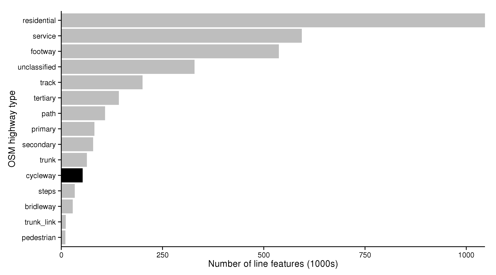

```{r, echo=FALSE, include=FALSE}
pkgs <- c("png", "grid")
lapply(pkgs, library, character.only = T)
# Local-Authority known cycle paths 
# attributes
# width/light/

# How OSM data is better - para.
# 
# To be fair to OSM para... - include areas where OS data excels.
# 
# The consequences of this finding...
# 
# Prospects for the future.
# 
# A research agenda referencing leading papers in the field
```

# Abstract

Evidence shows that urban infrastructure, including the quality of
dedicated cycle paths, is a strong determinant of rates of active travel.
To guide cycling investments it is therefore important
to assess the quality of existing infrastructure: routes with poor
provision but high cycling potential should be prioritised.
Identifying such routes, which are highly cost-effective, 
requires and evidence-base on the quality of the existing travel network
at high geographical resolution.

This paper presents a methodology for assessing the quality of
cycle path data and presents results from a systematic assessment
of two datasets in the UK, from Open Street Map (OSM) and
Ordnance Survey (OS). It was found that the OSM
data...

identify where improvements
to the travel network, this paper assesses the quality of diverse 

seeks to test the hypothesis that distributed,
user-contributed 'crowd sourced' data will eventually supercede the
traditional centralised data model. The empirical basis used
to explore this question is a couple of national-level datasets on a specific
domain area: bicycle paths in the UK. The two rival datasets are from
Open Street Map (OSM), representing the crowd-sourced model and the official
Urban Paths layer from the Ordnance Survey (OS) representing the centralised model.
To assess the quality of
each dataset, an array of tests was used. Objective measures of length,
number of nodes and features characterised the datasets in the first instance.
Aerial photography was used in sample locations to 'ground truth' the data.
And more subjective
metrics of usability and practical utility were developed to assess the practical
utility of each datasets for transport planning. 
The key finding was that OSM data won on the majority of criteria, 
a first for transport planning applications in a Western nation.
However, it must be noted that this is a niche area. We conclude that
if the
crowd-sourced data model is to triumph in more mainstream areas, it needs to
ensure much greater community 'buy-in'. 
The use and creation of OSM for educational and citizenship purposes
at school and university is the suggested way forward.


# Introduction

The relative merits of different geographic datasets
has long been a source of academic interest.
In the sixth century BC Herodotos, the
'first map maker', criticised the
inaccuracies of military maps
for [@Roller2010].
@Goodchild1989 brought these critques into the 20^th^ century,
in an edited compilation of papers on accuracy in spatial data.
This and other work has led to the emergence of
'testing spatial accuracy' as a sub-genre within the
GIS discipline [e.g. @hunter1995dealing; @thapa1992accuracy; @Arnold2011].

Throughout the vast majority of Geography's long history,
documented geographic information has been created by only a tiny
subset of the population. Millitary planners accross all cultures,
Roman road builders and, more recently, cartographers
armed with specialist and valuable equipment were among
the 'geographic 1%' with the priveledge of filling in the
blanks in humanity's perception of the world. Since Open Steet
Map began freely accepting data submissions from amatures
in 2002, we have been living in an era of Volunteered Geographic
Information (VGI) [@Goodchild2007]. Growth in
these new data sources far now far outstrips
the incremental and accretive growth in official
map source originating from trusted organisations.
In fact, the British Ordnance Survey and the
US Geological Survey (two of the world's most
respective providers of geographic information),
have already considered integrating the insights
gathered from an army of 'citizen sensors' into their
existing systems. The rapidly evolving landscape of
VGI from Social Media (VGI-SM), which is
becoming increasingly widespread with the penetration of
GPS-equipped smart phones in emerging
markets worldwide, only adds to the buzz surrounding crowd-sourced datasets.

```{r, echo=FALSE}
# Studies assessing the quality of such VGI have tended to do
# X, Y and Z. And this is where our paper fits in!
```

With this context in mind, and considering the accelerating
digital revolution bringing more citizen sensors on-line
every day, it is worth outlining the findings of this paper at the outset,
to put its central thesis in context. It was found that
crowd-sourced OSM data
outperformed centralised OS
data, from the perspective of active transport planning.
Moreover, the OSM dataset was found to be
more extensive, geographically
even and feature-rich than the OS offering. 
These findings have consequences: this is the first time, to our
knowledge, that VGI has been found to improve upon pre-existing
centralised data. Given the continuous improvements of
VGI in general, and OSM in particular, we believe that the
findings presented in this paper offer a glimpse into the future:
a future where citizen-contributed VGI becomes *the* official
dataset. If, as we expect, OSM gradually replaces official 
geographic datasets worldwide in a similar way that Wikipedia
has replaced legacy encyclopedias, 
the impacts will be enormous.

It is not our place here to speculate about what such a world
would look like. Visions of the future range from a fractured
and highly censored series of 'internets' broken up along
geopolitical lines [@kahn2011america]
to an open-source world of collaboration for mutual benefit
[@Chamberlain2013].
All we can say with for certain is that the subsequent analysis
of bicycle paths offers some insight into what the world
*could* look like. Whilst openly advocating the many advantages
of open-access datasets, especially the ethical and democratic
higher ground that they advocate, we are no blind idealists.
OSM has several serious limitations that will be described
below, which demand attention. Indeed, we believe that the analysis
presented in this paper provides a strong argument for official
mapping authorities to 'smell the coffee' regarding VGI.
If some kind of well-resourced public body does not intervene
to ensure high standards within OSM and other VGI, some
the potential benefits could be lost.

Though the scope of these introductory comments are
broad, the empirical aims and objectives of the study are
narrow. The empirical aims of the project are as follows:

1. Describe the cycle path data in Open Street Map and test the hypothesis that it is a good source of data on cycle paths in Great Britain, suitable for academic research.
2. Compare the OSM cycle path data with a proprietary dataset.
3. Describe and explain the spatio-temporal distribution of additions to the the cycle path dataset and investigate how this corresponds with investment in cycle schemes overall.
4. Use the results to discuss the use of crowd-sourced data in mission-critical
professional planning applications.


# Datasets

```{r, echo=FALSE}
# nrow(cways)
# nrow(bicycle_most)
# nrow(ncn)
```


## Open Street Map data

The cycle paths were extracted from the up-to-date and
compressed 'british-isles' .osm.pbf
file (746 Mb),
downloaded from OSM services provider
[Geofabrik.de](http://download.geofabrik.de/europe/british-isles.html). This was converted for processing into a raw .osm
(14.7 Gb) text
file, a variant of the xml filetype, using the command-line program **osmconvert**,
accessed through the Linux command line.

To take only navigable paths, the first stage was to subset all *ways*.
This led to a 4.9 Gb file containing 3.35 million features. Of course,
only a small sample of this large dataset is related to cycling (Fig. x).
A careful sampling strategy was therefore used to ensure all bicycle paths,
according to OSM data, were captured and whilst minimising
data that do not represent bicycle paths. As shown in Fig. x,
the majority of the route network in OSM is *potentially* cyclable,
with most residential, service and unclassified highways being suitable
for bicycles. However, we are not interested in where one *can* cycle
in this dataset: the focus is on where local authorities and other organisations
have invested in sustainable transport by constructing bicycle paths.
The 'cycleway' tag is the 11th most commonly used tag, comprising 1.6%
of all highway tags in Great Britain. 

```{r, echo=FALSE}
# summary(hways$highway)
# top10 <- rev(tail(sort(summary(hways$highway)), 15))
# labs <- factor(names(top10), levels = rev(names(top10)) )
# # top10 <- sort(summary(hways$highway), decreasing = T)[1:10]
# # sort(summary(hways$highway))[ length(top10) - 10: length]
# ggplot() + geom_bar(aes(x = labs, y = top10 / 1000, fill = labs), stat = "identity") +
#   coord_flip() +
#   scale_y_continuous(expand = c(0, 0)) +
#   scale_fill_manual(values = c(rep("grey", 4), "black", rep("grey", 10)), guide = F) +
#   xlab("OSM highway type") +
#   ylab("Number of line features (1000s)") +
#   theme_classic()   
# ggsave("figures/osm-highway-types.png", width = 9, height = 5)
```



Tagged cycleways comprise only a small proportion of recommended *cycle routes* in OSM,
which are defined using a wide variety of both tags and relations.
This means that extracting all cycle routes cannot be acheived
with a simple one-line operation. The following command, using the command-line
Java program `osmfilter`, for example, will extract only a sample of the
total length of cycle paths stored in Open Street Map:

```{r, eval=FALSE}
osmfilter data.osm --keep="highway=cycleway" >bcways.osm
```

This is because the 'cycleway' attribute
is only one of the possible *tags* used to represent cycle paths.
There are many additional tags from a variety of variables that can
but used to identify cycle paths, each with subtly different
(and sometimes overlapping)
meanings (Table x).

Table x: Overview of the most commonly used cycling-related variables and
tags in Open Street Map. Note that percentages in bold refer to the proportion
of the *network* (tag = * is a wildcard) while the denominator for the specific tags
is the count of non-empty rows *for that variable*. Quoted text is taken from
the OSM wiki.

\clearpage

Table 1: Overview of the OSM dataset of highways in the UK and tags related to cycle paths.

|Variable  |Tag           |  Number| Percentage|Meaning                                                       |
|:---------|:-------------|-------:|----------:|:-------------------------------------------------------------|
|**highway=  **|*             | 3351300|      100.0|                                                              |
|          |cycleway      |   52672|        1.6|Dedicated bicycle paths                                       |
|**bicycle=  **|*             |  128493|        3.8|How permitted are bicycles on the path                        |
|          |yes           |   79586|       61.9|Bicycle can ride here, but it is not necessarily a bike path  |
|          |no            |   24162|       18.8|Bicycles are not permitted                                    |
|          |designated    |   16036|       12.5|“Where a way has been specially designated”                   |
|          |dismount      |    4015|        3.1|You must push your bike by law                                |
|**cycleway=** |*             |   34085|        1.0|“Cycling infrastructure that is an inherent part of the road” |
|          |no            |   16472|       48.3|No bicycle path                                               |
|          |track         |    6926|       20.3|Cycle path separated from the road, e.g. by a curb            |
|          |lane          |    8831|       25.9|On road/shared use bicycle path                               |
|          |shared        |    1560|        4.6|“Cyclists share space with other traffic on this highway”     |
|          |opposite_lane |     806|        2.4|A 'contraflow' cycle lane                                     |
|          |share_busway  |     502|        1.5|Bicycles share space with buses                               |
|          |opposite      |     414|        1.2|Bicycles can travel either way                                |
|**lcn= **     |*             |   15320|        0.5|Local cycle routes                                            |
|          |yes           |   13193|       86.1|Completed                                                     |
|          |proposed      |    1536|       10.0|Proposed/under construction                                   |
|**ncn_ref= ** |*             |   12684|        0.4|Reference of National Cycling Network paths                   |
|          |1             |    1179|        9.3|NCN route 1                                                   |
|          |5             |    1003|        7.9|NCN route5                                                    |
|**ncn=  **    |*             |    3313|        0.1|Is part of the National Cycling Network                       |
|          |yes           |    2368|       71.5|Completed                                                     |
|          |proposed      |     888|       26.8|Proposed/under construction                                   |
|**towpath= ** |*             |    2795|        0.1|The route is along a canal towpath                            |

It is important to note that although the tags presented in figure x are *related*
to cycling, they certainly do not all imply the presence of a bicycle path.
(Definition of a bicycle path...)
Returning to the narrow definition of a bicycle path offered in xx, we are interested
only in urban infrastructure that is *specifically designed* to cater for cyclists
in some way, indicating some investment in cycling.

Based on a careful reading of the 'official' tag description from the OSM wiki page,
and visual inspection of the paths overlaying aerial photography, a list of these
'cycle infrastructure' tags was compiled. These were:

```{r engine='bash', eval=FALSE}
"highway"  =  'cycleway' OR "bicycle" = 'designated' OR 
"cycleway" = 'track' OR "cycleway" =  'lane' OR 
"cycleway" = 'shared' OR "cycleway" = 'opposite_lane' OR 
"cycleway" = 'opposite_track' OR "cycleway" = 'segregated' OR
"cycleway" = 'shared_lane' OR "cycleway" = 'yes' OR 
"cycleway:left" = 'lane' OR "cycleway:left" = 'track' OR 
"cycleway:right" = 'lane' OR  "cycleway:right" = 'track' OR 
"cycleway:oneside" =  'lane' OR "cycleway:otherside" = 'lane' OR 
"path.bicycle" = 'designated'
```

## Ordnance Survey data

The Ordnance Survey (OS) data was obtained from their central office
after completion of a non-disclosure aggreement. Following
substantial software challenges, requiring expensive propriatary
software (ArcMap 9), the entire OS dataset was loaded for the UK and could be
analysed (Fig. x).

```{r, echo=FALSE, fig.cap="Overview of the Ordnance Survey dataset"}
grid.raster(readPNG("figures/all4-os.png"))
```

Analysis shows that where OS
and OSM datasets do overlap (in a minority of the paths' lengths for both
datasets), the correspondence between them is good, with the OS dataset
having higher spatial resolution (Fig. x).

```{r, echo=FALSE, fig.cap="Example of partial correspondence between OSM and OS cycle path data. Note this is not at all representative of the UK."}
grid.raster(readPNG("figures/jubilee.png"))
# \begin{figure}[htbp] \begin{center}
#   \includegraphics[width=0.5\textwidth]{figures/jubilee.png}
# \caption{Example of partial correspondence between OSM and OS cycle path data.
# Note this is not at all representative of the UK.}
# \label{fhtypes} \end{center} \end{figure} 
```

# Methods and results

# Discussion

# Conclusion

This is the first study to our knowledge which decisively finds a free
and crowd-sourced dataset to be more appropriate to a critical
application than a professionally produced proprietary dataset from a
national cartographic organisation. In this case, Open Street Map was
found to provide more coverage, attributes, continuity and recency than
the commercial dataset provided by the UK's national geospatial data
provider Ordnance Survey.

Many future research directions are opened-up by this study, including
more systematic and 'real time' tests of different geographical datasets
to provide 'health checks' of suitability for different applications;
other niche areas where crowd sourced geographical data may be more
appropriate than centralised sources; and the potential for national mapping
bodies such as Ordnance Survey to incorporate the richness of crowd-sourced
offerings into their official products. All of these themes intersect with wider
questions about the 'democratisation' of academia [@berry_free_2006] and open
up exiting possibilities for combining educational benefits with improved
public data administration.

# References


